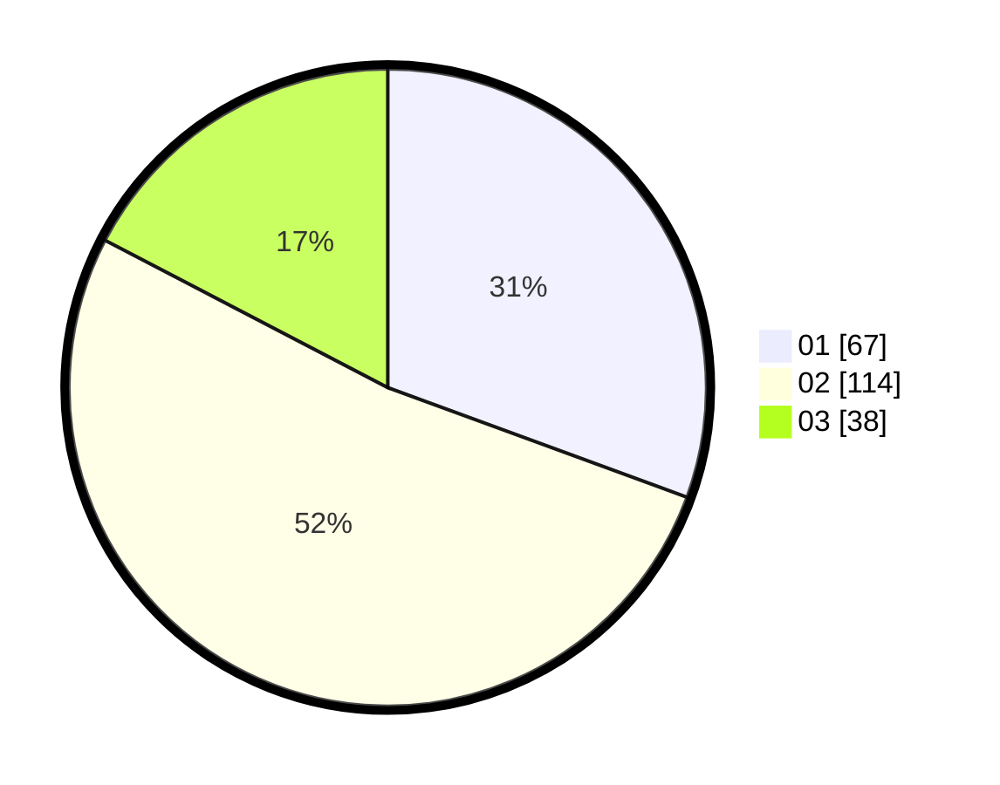

# Hasil

Hasil perolehan suara paslon dapat dilihat pada file paslon-01.txt, paslon-02.txt, dan paslon-03.txt.

Jika tidak ada, artinya data tersebut belum ada pada SIREKAP.

## Perolehan Suara

 * Paslon 01: **67**.
 * Paslon 02: **114**.
 * Paslon 03: **38**.

## Foto C Plano

https://sirekap-obj-formc.kpu.go.id/5e2e/pemilu/ppwp/31/72/04/10/03/3172041003067-20240214-231412--fd49779e-35eb-43d4-946b-991d7f3afc72.jpg

https://sirekap-obj-formc.kpu.go.id/5e2e/pemilu/ppwp/31/72/04/10/03/3172041003067-20240214-231451--1fa5067e-4a78-4516-b64f-e1c19f3cf177.jpg

https://sirekap-obj-formc.kpu.go.id/5e2e/pemilu/ppwp/31/72/04/10/03/3172041003067-20240214-231555--25a2d547-3b5c-4515-8747-f438b7634072.jpg

## DATA PEMILIH TETAP

Jumlah pemilih dalam DPT: **289**.
 * L: **141**.
 * P: **148**.

## DATA PENGGUNA HAK PILIH

Jumlah pengguna hak pilih dalam DPT: **289**.
 * L: **141**.
 * P: **148**.

Jumlah pengguna hak pilih dalam DPTb: **1**.
 * L: **1**.
 * P: **0**.

Jumlah pengguna hak pilih dalam DPK: **0**.
 * L: **0**.
 * P: **0**.

Jumlah pengguna hak pilih: **290**.
 * L: **142**.
 * P: **148**.

## JUMLAH SUARA SAH DAN TIDAK SAH

JUMLAH SELURUH SUARA SAH: **219**.

JUMLAH SUARA TIDAK SAH: **4**.

JUMLAH SELURUH SUARA SAH DAN SUARA TIDAK SAH: **223**.
