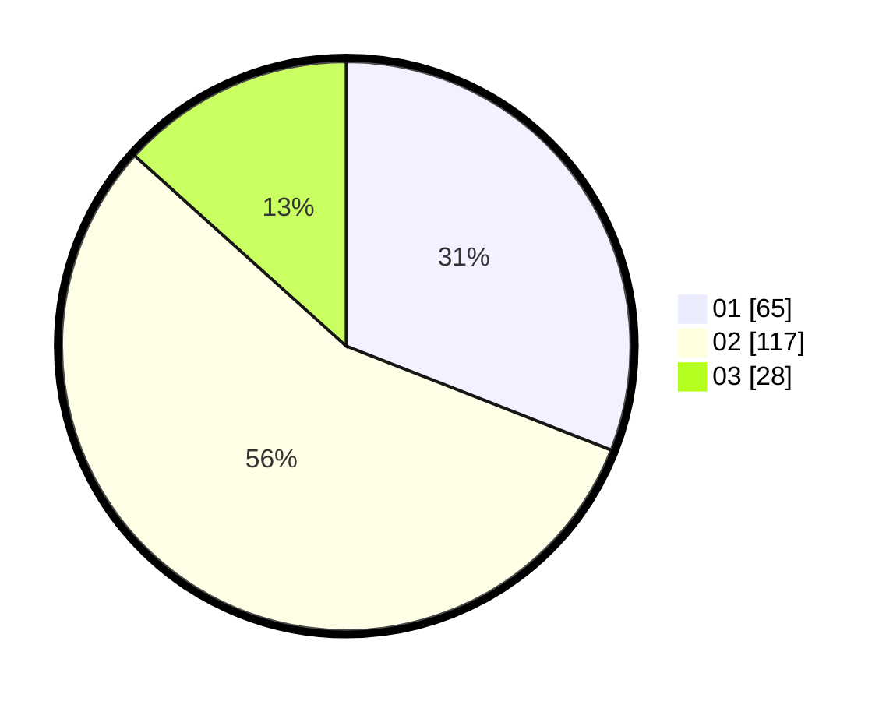

# Hasil

Hasil perolehan suara paslon dapat dilihat pada file paslon-01.txt, paslon-02.txt, dan paslon-03.txt.

Jika tidak ada, artinya data tersebut belum ada pada SIREKAP.

## Perolehan Suara

 * Paslon 01: **65**.
 * Paslon 02: **117**.
 * Paslon 03: **28**.

## Foto C Plano

https://sirekap-obj-formc.kpu.go.id/6a53/pemilu/ppwp/31/72/04/10/03/3172041003069-20240216-115351--77ece4fc-2717-4607-92c1-803cd34f0781.jpg

https://sirekap-obj-formc.kpu.go.id/6a53/pemilu/ppwp/31/72/04/10/03/3172041003069-20240215-015023--62c243d4-099c-4ffc-ae81-d2dc06104d15.jpg

https://sirekap-obj-formc.kpu.go.id/6a53/pemilu/ppwp/31/72/04/10/03/3172041003069-20240215-015128--043a3159-c138-43d2-be58-458090c7b0bb.jpg

## DATA PEMILIH TETAP

Jumlah pemilih dalam DPT: **273**.
 * L: **141**.
 * P: **132**.

## DATA PENGGUNA HAK PILIH

Jumlah pengguna hak pilih dalam DPT: **212**.
 * L: **92**.
 * P: **120**.

Jumlah pengguna hak pilih dalam DPTb: **3**.
 * L: **2**.
 * P: **1**.

Jumlah pengguna hak pilih dalam DPK: **0**.
 * L: **0**.
 * P: **0**.

Jumlah pengguna hak pilih: **215**.
 * L: **94**.
 * P: **121**.

## JUMLAH SUARA SAH DAN TIDAK SAH

JUMLAH SELURUH SUARA SAH: **210**.

JUMLAH SUARA TIDAK SAH: **5**.

JUMLAH SELURUH SUARA SAH DAN SUARA TIDAK SAH: **215**.
