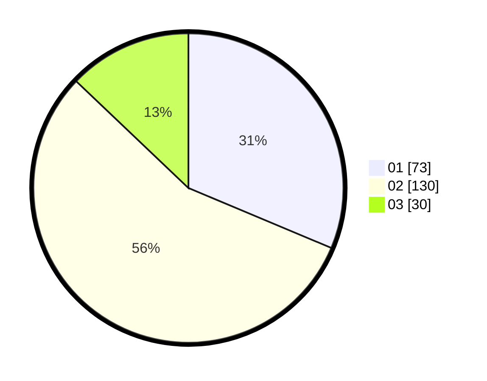

# Hasil

Hasil perolehan suara paslon dapat dilihat pada file paslon-01.txt, paslon-02.txt, dan paslon-03.txt.

Jika tidak ada, artinya data tersebut belum ada pada SIREKAP.

## Perolehan Suara

 * Paslon 01: **73**.
 * Paslon 02: **130**.
 * Paslon 03: **30**.

## Foto C Plano

https://sirekap-obj-formc.kpu.go.id/a476/pemilu/ppwp/31/72/04/10/03/3172041003071-20240214-232238--c23517d2-8d1d-44c5-aff1-8ce58e6f925c.jpg

https://sirekap-obj-formc.kpu.go.id/a476/pemilu/ppwp/31/72/04/10/03/3172041003071-20240214-232440--04222b7d-4c5d-40c8-b4e8-6b2b9711fb55.jpg

https://sirekap-obj-formc.kpu.go.id/a476/pemilu/ppwp/31/72/04/10/03/3172041003071-20240214-232631--3f4c4ae8-52c6-4e57-91d0-984b022980e9.jpg

## DATA PEMILIH TETAP

Jumlah pemilih dalam DPT: **298**.
 * L: **141**.
 * P: **157**.

## DATA PENGGUNA HAK PILIH

Jumlah pengguna hak pilih dalam DPT: **227**.
 * L: **108**.
 * P: **119**.

Jumlah pengguna hak pilih dalam DPTb: **8**.
 * L: **3**.
 * P: **5**.

Jumlah pengguna hak pilih dalam DPK: **0**.
 * L: **0**.
 * P: **0**.

Jumlah pengguna hak pilih: **235**.
 * L: **111**.
 * P: **124**.

## JUMLAH SUARA SAH DAN TIDAK SAH

JUMLAH SELURUH SUARA SAH: **233**.

JUMLAH SUARA TIDAK SAH: **2**.

JUMLAH SELURUH SUARA SAH DAN SUARA TIDAK SAH: **235**.
