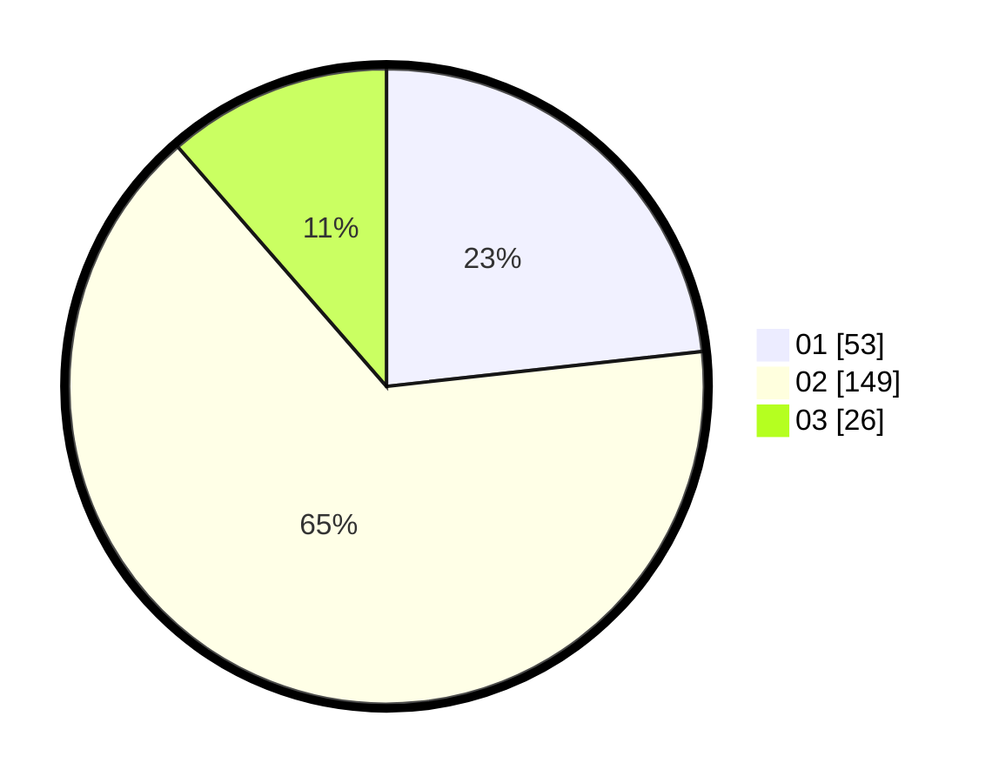

# Hasil

Hasil perolehan suara paslon dapat dilihat pada file paslon-01.txt, paslon-02.txt, dan paslon-03.txt.

Jika tidak ada, artinya data tersebut belum ada pada SIREKAP.

## Perolehan Suara

 * Paslon 01: **53**.
 * Paslon 02: **149**.
 * Paslon 03: **26**.

## Foto C Plano

https://sirekap-obj-formc.kpu.go.id/8d37/pemilu/ppwp/31/72/04/10/03/3172041003078-20240214-194118--8c42282d-1b10-4778-bbef-e371657caf75.jpg

https://sirekap-obj-formc.kpu.go.id/8d37/pemilu/ppwp/31/72/04/10/03/3172041003078-20240214-194303--1f3dfb58-8f65-4dea-98bf-bec83e1e7db8.jpg

https://sirekap-obj-formc.kpu.go.id/8d37/pemilu/ppwp/31/72/04/10/03/3172041003078-20240214-194655--96b3fbad-52bd-4386-85c3-6b2cb477c214.jpg

## DATA PEMILIH TETAP

Jumlah pemilih dalam DPT: **288**.
 * L: **147**.
 * P: **141**.

## DATA PENGGUNA HAK PILIH

Jumlah pengguna hak pilih dalam DPT: **231**.
 * L: **120**.
 * P: **111**.

Jumlah pengguna hak pilih dalam DPTb: **0**.
 * L: **0**.
 * P: **0**.

Jumlah pengguna hak pilih dalam DPK: **0**.
 * L: **0**.
 * P: **0**.

Jumlah pengguna hak pilih: **231**.
 * L: **120**.
 * P: **111**.

## JUMLAH SUARA SAH DAN TIDAK SAH

JUMLAH SELURUH SUARA SAH: **228**.

JUMLAH SUARA TIDAK SAH: **3**.

JUMLAH SELURUH SUARA SAH DAN SUARA TIDAK SAH: **231**.
