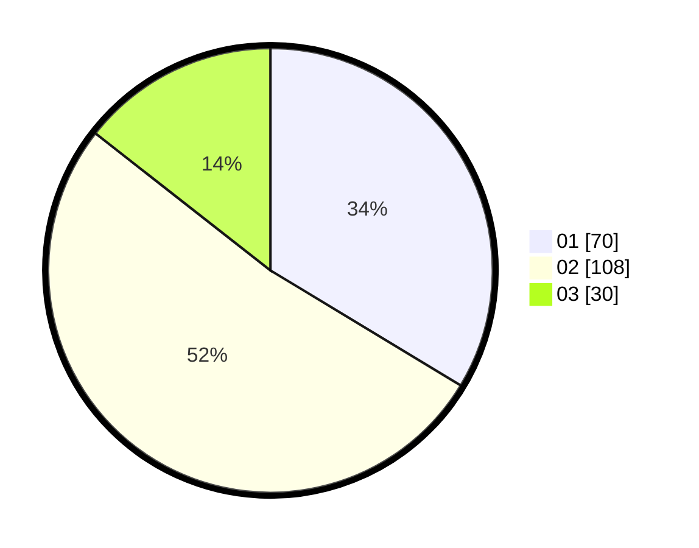

# Hasil

Hasil perolehan suara paslon dapat dilihat pada file paslon-01.txt, paslon-02.txt, dan paslon-03.txt.

Jika tidak ada, artinya data tersebut belum ada pada SIREKAP.

## Perolehan Suara

 * Paslon 01: **70**.
 * Paslon 02: **108**.
 * Paslon 03: **30**.

## Foto C Plano

https://sirekap-obj-formc.kpu.go.id/bf78/pemilu/ppwp/31/72/04/10/03/3172041003080-20240214-211813--f2d91971-4fcd-4363-965d-e2430a18172e.jpg

https://sirekap-obj-formc.kpu.go.id/bf78/pemilu/ppwp/31/72/04/10/03/3172041003080-20240214-155831--f46ef093-3fc5-46f7-8f1c-c2193f93853e.jpg

https://sirekap-obj-formc.kpu.go.id/bf78/pemilu/ppwp/31/72/04/10/03/3172041003080-20240214-211946--4854fda6-2af4-4aaf-877e-f331c570d301.jpg
