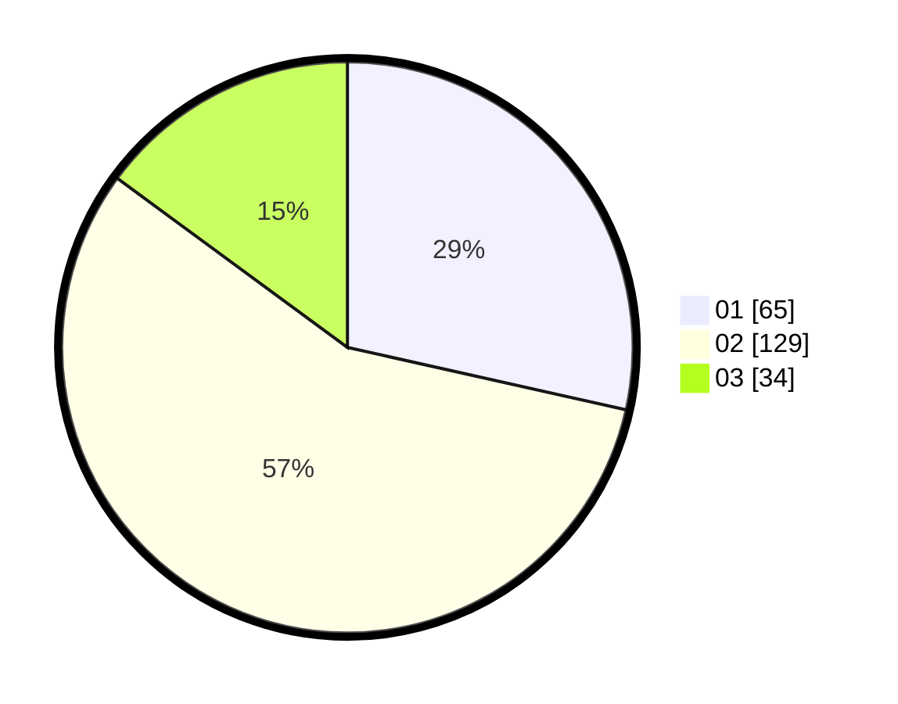

# Hasil

Hasil perolehan suara paslon dapat dilihat pada file paslon-01.txt, paslon-02.txt, dan paslon-03.txt.

Jika tidak ada, artinya data tersebut belum ada pada SIREKAP.

## Perolehan Suara

 * Paslon 01: **65**.
 * Paslon 02: **129**.
 * Paslon 03: **34**.

## Foto C Plano

https://sirekap-obj-formc.kpu.go.id/37c2/pemilu/ppwp/31/72/04/10/03/3172041003086-20240216-133915--121e5f62-3fb1-4c08-a613-b755afd91ffa.jpg

https://sirekap-obj-formc.kpu.go.id/37c2/pemilu/ppwp/31/72/04/10/03/3172041003086-20240216-133916--94ae36b3-6fda-4463-8595-d45d3e25a73d.jpg

https://sirekap-obj-formc.kpu.go.id/37c2/pemilu/ppwp/31/72/04/10/03/3172041003086-20240216-133915--1eb94d79-6eae-42f1-a827-4ff8b81c7163.jpg

## DATA PEMILIH TETAP

Jumlah pemilih dalam DPT: **276**.
 * L: **150**.
 * P: **126**.

## DATA PENGGUNA HAK PILIH

Jumlah pengguna hak pilih dalam DPT: **230**.
 * L: **124**.
 * P: **106**.

Jumlah pengguna hak pilih dalam DPTb: **2**.
 * L: **1**.
 * P: **1**.

Jumlah pengguna hak pilih dalam DPK: **0**.
 * L: **0**.
 * P: **0**.

Jumlah pengguna hak pilih: **232**.
 * L: **125**.
 * P: **107**.

## JUMLAH SUARA SAH DAN TIDAK SAH

JUMLAH SELURUH SUARA SAH: **228**.

JUMLAH SUARA TIDAK SAH: **2**.

JUMLAH SELURUH SUARA SAH DAN SUARA TIDAK SAH: **230**.
