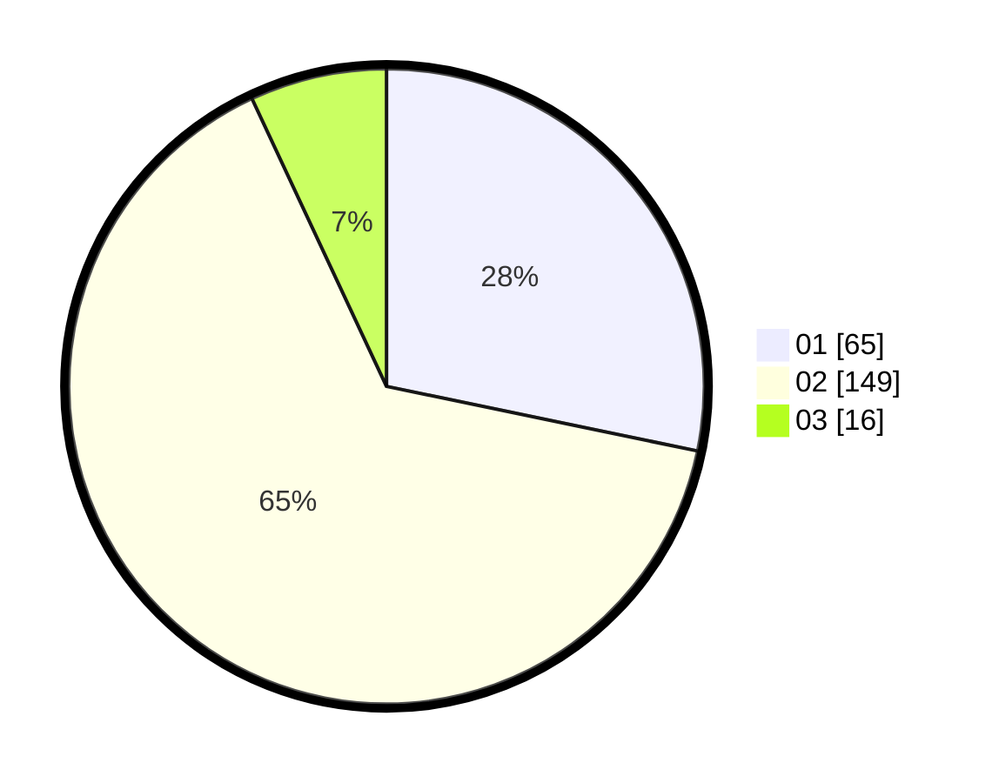

# Hasil

Hasil perolehan suara paslon dapat dilihat pada file paslon-01.txt, paslon-02.txt, dan paslon-03.txt.

Jika tidak ada, artinya data tersebut belum ada pada SIREKAP.

## Perolehan Suara

 * Paslon 01: **65**.
 * Paslon 02: **149**.
 * Paslon 03: **16**.

## Foto C Plano

https://sirekap-obj-formc.kpu.go.id/ae0b/pemilu/ppwp/31/72/04/10/03/3172041003094-20240214-192331--f01b3acf-dde2-401d-aaa4-3de46cd48434.jpg

https://sirekap-obj-formc.kpu.go.id/ae0b/pemilu/ppwp/31/72/04/10/03/3172041003094-20240214-192341--f3d44c10-b295-4834-9105-435e8442195e.jpg

https://sirekap-obj-formc.kpu.go.id/ae0b/pemilu/ppwp/31/72/04/10/03/3172041003094-20240214-192354--018ff2af-fb31-49e5-8e3e-50cf4682814e.jpg

## DATA PEMILIH TETAP

Jumlah pemilih dalam DPT: **272**.
 * L: **132**.
 * P: **140**.

## DATA PENGGUNA HAK PILIH

Jumlah pengguna hak pilih dalam DPT: **272**.
 * L: **132**.
 * P: **140**.

Jumlah pengguna hak pilih dalam DPTb: **1**.
 * L: **1**.
 * P: **0**.

Jumlah pengguna hak pilih dalam DPK: **3**.
 * L: **0**.
 * P: **3**.

Jumlah pengguna hak pilih: **276**.
 * L: **133**.
 * P: **143**.

## JUMLAH SUARA SAH DAN TIDAK SAH

JUMLAH SELURUH SUARA SAH: **230**.

JUMLAH SUARA TIDAK SAH: **4**.

JUMLAH SELURUH SUARA SAH DAN SUARA TIDAK SAH: **234**.
