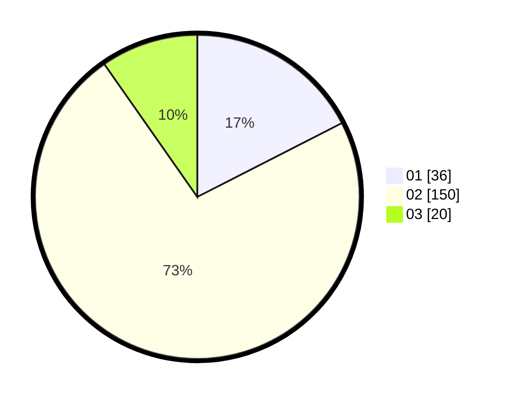

# Hasil

Hasil perolehan suara paslon dapat dilihat pada file paslon-01.txt, paslon-02.txt, dan paslon-03.txt.

Jika tidak ada, artinya data tersebut belum ada pada SIREKAP.

## Perolehan Suara

 * Paslon 01: **36**.
 * Paslon 02: **150**.
 * Paslon 03: **20**.

## Foto C Plano

https://sirekap-obj-formc.kpu.go.id/0d2e/pemilu/ppwp/31/72/04/10/03/3172041003095-20240216-132723--e54e26eb-4307-468f-85f8-fee4406fad55.jpg

https://sirekap-obj-formc.kpu.go.id/0d2e/pemilu/ppwp/31/72/04/10/03/3172041003095-20240214-185758--c6dc1f26-8cc4-468d-92eb-abf92c7f2b7c.jpg

https://sirekap-obj-formc.kpu.go.id/0d2e/pemilu/ppwp/31/72/04/10/03/3172041003095-20240214-185747--5110eb34-d59c-43ea-a61a-4a2fe88b4d90.jpg

## DATA PEMILIH TETAP

Jumlah pemilih dalam DPT: **259**.
 * L: **133**.
 * P: **126**.

## DATA PENGGUNA HAK PILIH

Jumlah pengguna hak pilih dalam DPT: **210**.
 * L: **103**.
 * P: **107**.

Jumlah pengguna hak pilih dalam DPTb: **0**.
 * L: **0**.
 * P: **0**.

Jumlah pengguna hak pilih dalam DPK: **1**.
 * L: **1**.
 * P: **0**.

Jumlah pengguna hak pilih: **211**.
 * L: **104**.
 * P: **107**.

## JUMLAH SUARA SAH DAN TIDAK SAH

JUMLAH SELURUH SUARA SAH: **206**.

JUMLAH SUARA TIDAK SAH: **5**.

JUMLAH SELURUH SUARA SAH DAN SUARA TIDAK SAH: **211**.
