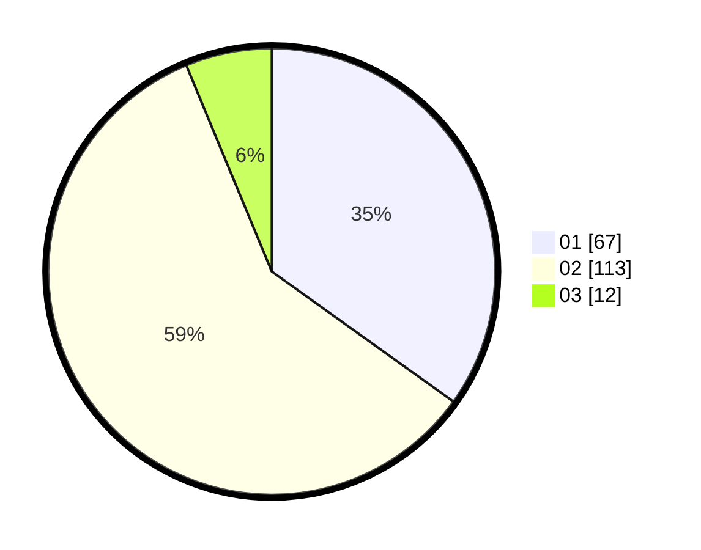

# Hasil

Hasil perolehan suara paslon dapat dilihat pada file paslon-01.txt, paslon-02.txt, dan paslon-03.txt.

Jika tidak ada, artinya data tersebut belum ada pada SIREKAP.

## Perolehan Suara

 * Paslon 01: **67**.
 * Paslon 02: **113**.
 * Paslon 03: **12**.

## Foto C Plano

https://sirekap-obj-formc.kpu.go.id/2682/pemilu/ppwp/31/72/04/10/04/3172041004033-20240214-201419--7244a41f-1238-4351-8e22-8735e7950c6f.jpg

https://sirekap-obj-formc.kpu.go.id/2682/pemilu/ppwp/31/72/04/10/04/3172041004033-20240214-201758--1affdaf6-4237-448d-bd1f-bc271b22b433.jpg

https://sirekap-obj-formc.kpu.go.id/2682/pemilu/ppwp/31/72/04/10/04/3172041004033-20240214-223116--bd899441-7458-4c31-abf7-54b07d236ecb.jpg
