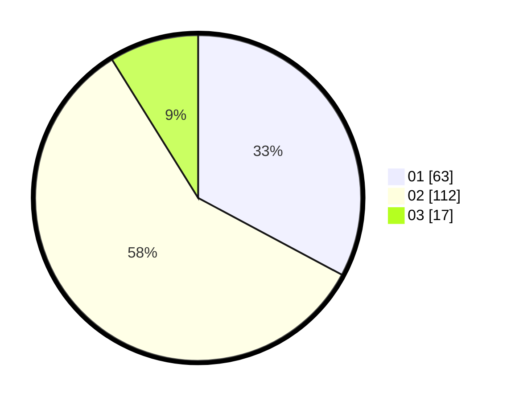

# Hasil

Hasil perolehan suara paslon dapat dilihat pada file paslon-01.txt, paslon-02.txt, dan paslon-03.txt.

Jika tidak ada, artinya data tersebut belum ada pada SIREKAP.

## Perolehan Suara

 * Paslon 01: **63**.
 * Paslon 02: **112**.
 * Paslon 03: **17**.

## Foto C Plano

https://sirekap-obj-formc.kpu.go.id/4b04/pemilu/ppwp/31/72/04/10/04/3172041004035-20240214-194253--2e631afc-48d9-42fe-a69f-08209f072243.jpg

https://sirekap-obj-formc.kpu.go.id/4b04/pemilu/ppwp/31/72/04/10/04/3172041004035-20240214-194306--528d7b73-7a2a-4090-bbad-ddb8f3c3574a.jpg

https://sirekap-obj-formc.kpu.go.id/4b04/pemilu/ppwp/31/72/04/10/04/3172041004035-20240214-225514--cf7b4e92-16a2-48f4-9a78-939a575f5bc2.jpg
