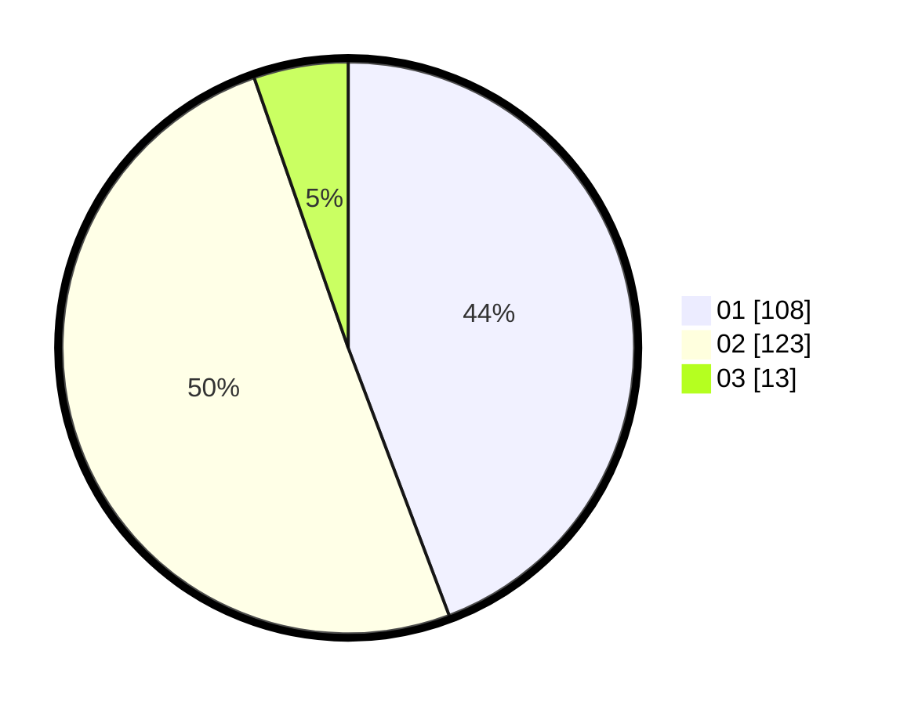

# Hasil

Hasil perolehan suara paslon dapat dilihat pada file paslon-01.txt, paslon-02.txt, dan paslon-03.txt.

Jika tidak ada, artinya data tersebut belum ada pada SIREKAP.

## Perolehan Suara

 * Paslon 01: **108**.
 * Paslon 02: **123**.
 * Paslon 03: **13**.

## Foto C Plano

https://sirekap-obj-formc.kpu.go.id/d32e/pemilu/ppwp/31/72/04/10/04/3172041004043-20240214-201752--cbc0d700-6a1d-4365-8fad-adc0fa7e225e.jpg

https://sirekap-obj-formc.kpu.go.id/d32e/pemilu/ppwp/31/72/04/10/04/3172041004043-20240214-201758--0559b0f1-212e-42d3-ab57-6774a4e31ace.jpg

https://sirekap-obj-formc.kpu.go.id/d32e/pemilu/ppwp/31/72/04/10/04/3172041004043-20240214-213927--d6fd0067-824b-487f-83f8-41d0306df0e3.jpg

## DATA PEMILIH TETAP

Jumlah pemilih dalam DPT: **243**.
 * L: **116**.
 * P: **127**.

## DATA PENGGUNA HAK PILIH

Jumlah pengguna hak pilih dalam DPT: **243**.
 * L: **116**.
 * P: **127**.

Jumlah pengguna hak pilih dalam DPTb: **3**.
 * L: **1**.
 * P: **2**.

Jumlah pengguna hak pilih dalam DPK: **0**.
 * L: **0**.
 * P: **0**.

Jumlah pengguna hak pilih: **246**.
 * L: **117**.
 * P: **129**.

## JUMLAH SUARA SAH DAN TIDAK SAH

JUMLAH SELURUH SUARA SAH: **244**.

JUMLAH SUARA TIDAK SAH: **2**.

JUMLAH SELURUH SUARA SAH DAN SUARA TIDAK SAH: **246**.
