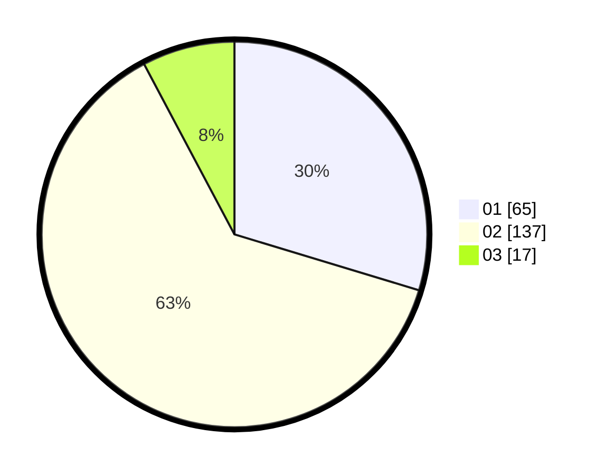

# Hasil

Hasil perolehan suara paslon dapat dilihat pada file paslon-01.txt, paslon-02.txt, dan paslon-03.txt.

Jika tidak ada, artinya data tersebut belum ada pada SIREKAP.

## Perolehan Suara

 * Paslon 01: **65**.
 * Paslon 02: **137**.
 * Paslon 03: **17**.

## Foto C Plano

https://sirekap-obj-formc.kpu.go.id/453b/pemilu/ppwp/31/72/04/10/04/3172041004047-20240216-000450--ed1f3a96-7fcc-4837-8b03-796c05b51440.jpg

https://sirekap-obj-formc.kpu.go.id/453b/pemilu/ppwp/31/72/04/10/04/3172041004047-20240216-000453--67193243-cf3d-4e33-8c86-180ed42ad41f.jpg

https://sirekap-obj-formc.kpu.go.id/453b/pemilu/ppwp/31/72/04/10/04/3172041004047-20240216-000452--8b2d6392-a5f0-4686-a83b-804ba70e5cf8.jpg

## DATA PEMILIH TETAP

Jumlah pemilih dalam DPT: **284**.
 * L: **136**.
 * P: **148**.

## DATA PENGGUNA HAK PILIH

Jumlah pengguna hak pilih dalam DPT: **218**.
 * L: **100**.
 * P: **118**.

Jumlah pengguna hak pilih dalam DPTb: **0**.
 * L: **0**.
 * P: **0**.

Jumlah pengguna hak pilih dalam DPK: **4**.
 * L: **1**.
 * P: **3**.

Jumlah pengguna hak pilih: **222**.
 * L: **101**.
 * P: **121**.

## JUMLAH SUARA SAH DAN TIDAK SAH

JUMLAH SELURUH SUARA SAH: **219**.

JUMLAH SUARA TIDAK SAH: **3**.

JUMLAH SELURUH SUARA SAH DAN SUARA TIDAK SAH: **222**.
