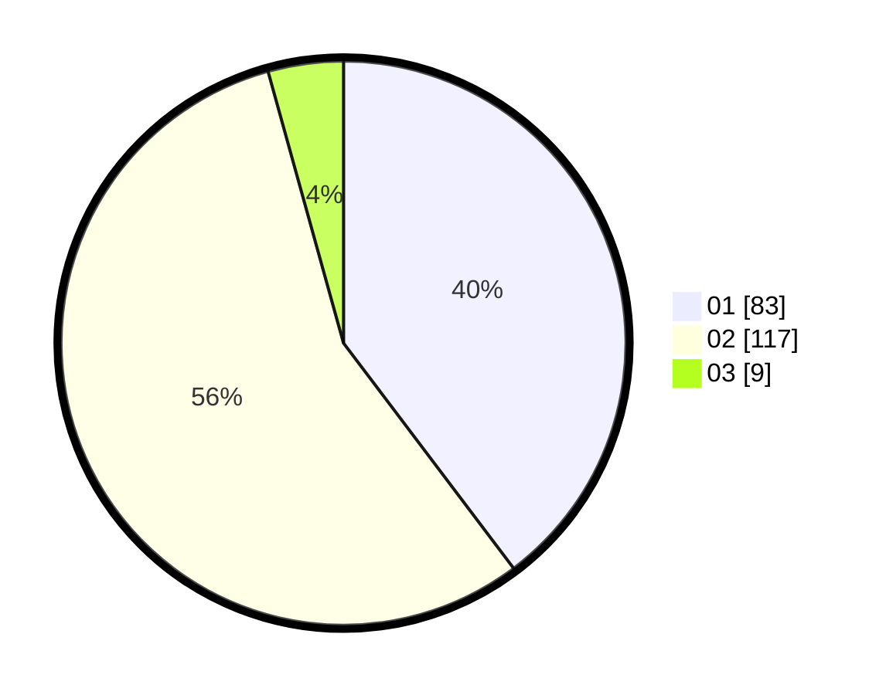

# Hasil

Hasil perolehan suara paslon dapat dilihat pada file paslon-01.txt, paslon-02.txt, dan paslon-03.txt.

Jika tidak ada, artinya data tersebut belum ada pada SIREKAP.

## Perolehan Suara

 * Paslon 01: **83**.
 * Paslon 02: **117**.
 * Paslon 03: **9**.

## Foto C Plano

https://sirekap-obj-formc.kpu.go.id/e1f3/pemilu/ppwp/31/72/04/10/04/3172041004052-20240214-193738--33f1e8e0-0a65-4a21-a2f8-ed060edc484f.jpg

https://sirekap-obj-formc.kpu.go.id/e1f3/pemilu/ppwp/31/72/04/10/04/3172041004052-20240214-193839--250de1f5-7055-4a49-b7da-d8ba1cf20734.jpg

https://sirekap-obj-formc.kpu.go.id/e1f3/pemilu/ppwp/31/72/04/10/04/3172041004052-20240214-193942--f50a3536-3df0-473d-83c5-02143b09a33f.jpg

## DATA PEMILIH TETAP

Jumlah pemilih dalam DPT: **285**.
 * L: **151**.
 * P: **134**.

## DATA PENGGUNA HAK PILIH

Jumlah pengguna hak pilih dalam DPT: **213**.
 * L: **108**.
 * P: **105**.

Jumlah pengguna hak pilih dalam DPTb: **1**.
 * L: **1**.
 * P: **0**.

Jumlah pengguna hak pilih dalam DPK: **0**.
 * L: **0**.
 * P: **0**.

Jumlah pengguna hak pilih: **214**.
 * L: **109**.
 * P: **105**.

## JUMLAH SUARA SAH DAN TIDAK SAH

JUMLAH SELURUH SUARA SAH: **209**.

JUMLAH SUARA TIDAK SAH: **5**.

JUMLAH SELURUH SUARA SAH DAN SUARA TIDAK SAH: **214**.
