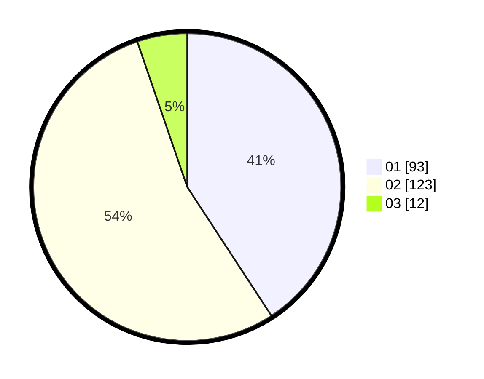

# Hasil

Hasil perolehan suara paslon dapat dilihat pada file paslon-01.txt, paslon-02.txt, dan paslon-03.txt.

Jika tidak ada, artinya data tersebut belum ada pada SIREKAP.

## Perolehan Suara

 * Paslon 01: **93**.
 * Paslon 02: **123**.
 * Paslon 03: **12**.

## Foto C Plano

https://sirekap-obj-formc.kpu.go.id/5cd0/pemilu/ppwp/31/72/04/10/04/3172041004054-20240214-141451--f366ec07-24e5-4164-ae98-8f2ccdf340e4.jpg

https://sirekap-obj-formc.kpu.go.id/5cd0/pemilu/ppwp/31/72/04/10/04/3172041004054-20240214-184805--48268d83-fb3a-4479-97f3-10cb43bc2bc8.jpg

https://sirekap-obj-formc.kpu.go.id/5cd0/pemilu/ppwp/31/72/04/10/04/3172041004054-20240215-030953--294a1d12-7a31-467d-892f-ddd733b0ded3.jpg

## DATA PEMILIH TETAP

Jumlah pemilih dalam DPT: **291**.
 * L: **151**.
 * P: **140**.

## DATA PENGGUNA HAK PILIH

Jumlah pengguna hak pilih dalam DPT: **231**.
 * L: **122**.
 * P: **109**.

Jumlah pengguna hak pilih dalam DPTb: **0**.
 * L: **0**.
 * P: **0**.

Jumlah pengguna hak pilih dalam DPK: **0**.
 * L: **0**.
 * P: **0**.

Jumlah pengguna hak pilih: **231**.
 * L: **122**.
 * P: **109**.

## JUMLAH SUARA SAH DAN TIDAK SAH

JUMLAH SELURUH SUARA SAH: **228**.

JUMLAH SUARA TIDAK SAH: **3**.

JUMLAH SELURUH SUARA SAH DAN SUARA TIDAK SAH: **231**.
