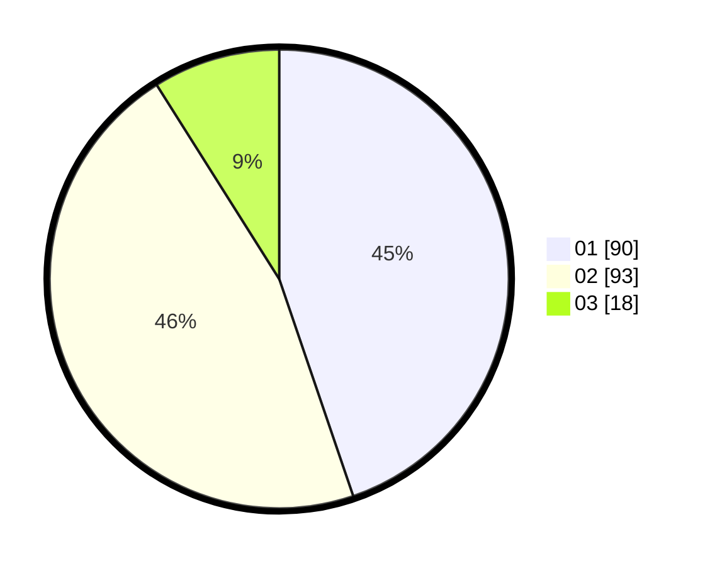

# Hasil

Hasil perolehan suara paslon dapat dilihat pada file paslon-01.txt, paslon-02.txt, dan paslon-03.txt.

Jika tidak ada, artinya data tersebut belum ada pada SIREKAP.

## Perolehan Suara

 * Paslon 01: **90**.
 * Paslon 02: **93**.
 * Paslon 03: **18**.

## Foto C Plano

https://sirekap-obj-formc.kpu.go.id/5d91/pemilu/ppwp/31/72/04/10/04/3172041004069-20240214-155221--790e6c6c-2ebf-43ab-a2d9-e07600764a27.jpg

https://sirekap-obj-formc.kpu.go.id/5d91/pemilu/ppwp/31/72/04/10/04/3172041004069-20240214-155603--78f16ecd-ca1e-42df-bdf4-e714fdf823b2.jpg

https://sirekap-obj-formc.kpu.go.id/5d91/pemilu/ppwp/31/72/04/10/04/3172041004069-20240214-160114--13e16526-c843-4c36-bd8e-7ea1577aab2a.jpg
