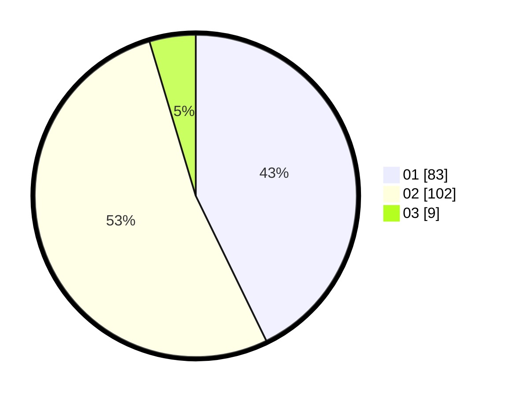

# Hasil

Hasil perolehan suara paslon dapat dilihat pada file paslon-01.txt, paslon-02.txt, dan paslon-03.txt.

Jika tidak ada, artinya data tersebut belum ada pada SIREKAP.

## Perolehan Suara

 * Paslon 01: **83**.
 * Paslon 02: **102**.
 * Paslon 03: **9**.

## Foto C Plano

https://sirekap-obj-formc.kpu.go.id/76b5/pemilu/ppwp/31/72/04/10/04/3172041004082-20240214-230111--18370c06-3d3c-4021-b354-ce3ad7b6d746.jpg

https://sirekap-obj-formc.kpu.go.id/76b5/pemilu/ppwp/31/72/04/10/04/3172041004082-20240214-230403--b1856e59-ce3e-4f9e-bf88-a5e4e3d0e25e.jpg

https://sirekap-obj-formc.kpu.go.id/76b5/pemilu/ppwp/31/72/04/10/04/3172041004082-20240214-230516--55338b1a-003d-47fc-bbd7-602df50e372e.jpg

## DATA PEMILIH TETAP

Jumlah pemilih dalam DPT: **240**.
 * L: **124**.
 * P: **116**.

## DATA PENGGUNA HAK PILIH

Jumlah pengguna hak pilih dalam DPT: **192**.
 * L: **97**.
 * P: **95**.

Jumlah pengguna hak pilih dalam DPTb: **1**.
 * L: **1**.
 * P: **0**.

Jumlah pengguna hak pilih dalam DPK: **2**.
 * L: **1**.
 * P: **1**.

Jumlah pengguna hak pilih: **195**.
 * L: **99**.
 * P: **96**.

## JUMLAH SUARA SAH DAN TIDAK SAH

JUMLAH SELURUH SUARA SAH: **194**.

JUMLAH SUARA TIDAK SAH: **3**.

JUMLAH SELURUH SUARA SAH DAN SUARA TIDAK SAH: **197**.
