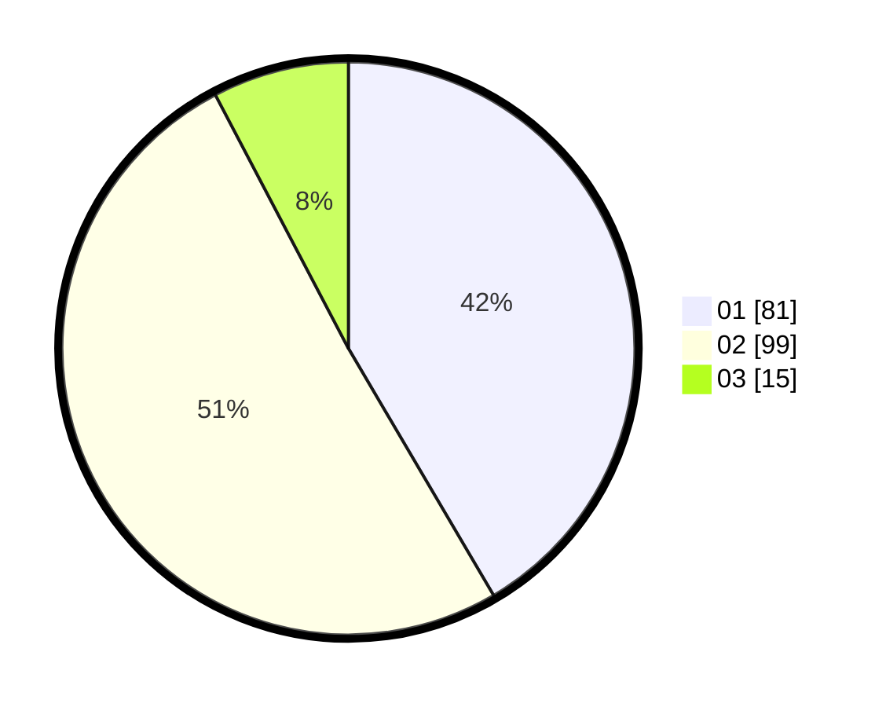

# Hasil

Hasil perolehan suara paslon dapat dilihat pada file paslon-01.txt, paslon-02.txt, dan paslon-03.txt.

Jika tidak ada, artinya data tersebut belum ada pada SIREKAP.

## Perolehan Suara

 * Paslon 01: **81**.
 * Paslon 02: **99**.
 * Paslon 03: **15**.

## Foto C Plano

https://sirekap-obj-formc.kpu.go.id/0938/pemilu/ppwp/31/72/04/10/04/3172041004100-20240214-231446--8e680eb8-fff6-4b67-ab2b-3aef273f472f.jpg

https://sirekap-obj-formc.kpu.go.id/0938/pemilu/ppwp/31/72/04/10/04/3172041004100-20240214-231023--6fd4d4ae-52ba-49d0-90ec-21b993cb198f.jpg

https://sirekap-obj-formc.kpu.go.id/0938/pemilu/ppwp/31/72/04/10/04/3172041004100-20240214-231741--86b712d6-50c3-4826-bdee-cdc359a87154.jpg

## DATA PEMILIH TETAP

Jumlah pemilih dalam DPT: **198**.
 * L: **95**.
 * P: **103**.

## DATA PENGGUNA HAK PILIH

Jumlah pengguna hak pilih dalam DPT: **197**.
 * L: **94**.
 * P: **103**.

Jumlah pengguna hak pilih dalam DPTb: **1**.
 * L: **1**.
 * P: **0**.

Jumlah pengguna hak pilih dalam DPK: **0**.
 * L: **0**.
 * P: **0**.

Jumlah pengguna hak pilih: **198**.
 * L: **95**.
 * P: **103**.

## JUMLAH SUARA SAH DAN TIDAK SAH

JUMLAH SELURUH SUARA SAH: **195**.

JUMLAH SUARA TIDAK SAH: **3**.

JUMLAH SELURUH SUARA SAH DAN SUARA TIDAK SAH: **198**.
