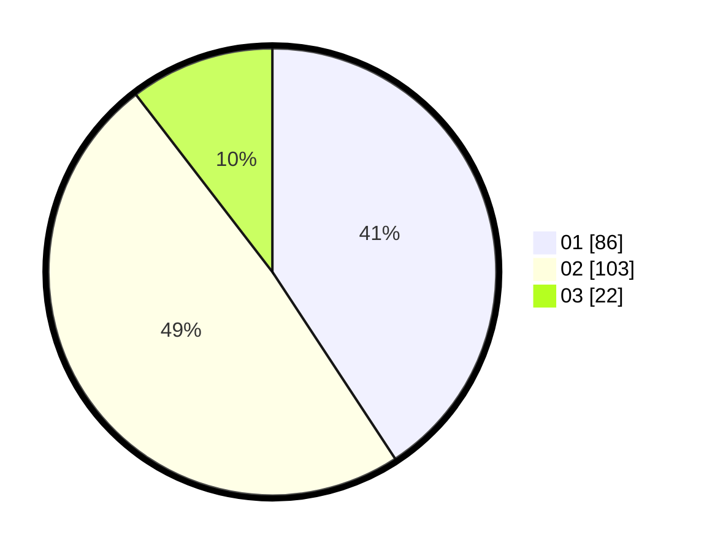

# Hasil

Hasil perolehan suara paslon dapat dilihat pada file paslon-01.txt, paslon-02.txt, dan paslon-03.txt.

Jika tidak ada, artinya data tersebut belum ada pada SIREKAP.

## Perolehan Suara

 * Paslon 01: **86**.
 * Paslon 02: **103**.
 * Paslon 03: **22**.

## Foto C Plano

https://sirekap-obj-formc.kpu.go.id/8645/pemilu/ppwp/31/72/04/10/04/3172041004107-20240214-212707--27380e5d-df0f-419d-bfa8-572d31b0c900.jpg

https://sirekap-obj-formc.kpu.go.id/8645/pemilu/ppwp/31/72/04/10/04/3172041004107-20240214-155511--f4e5a3c5-790f-403e-a8c3-dd176a2731d7.jpg
