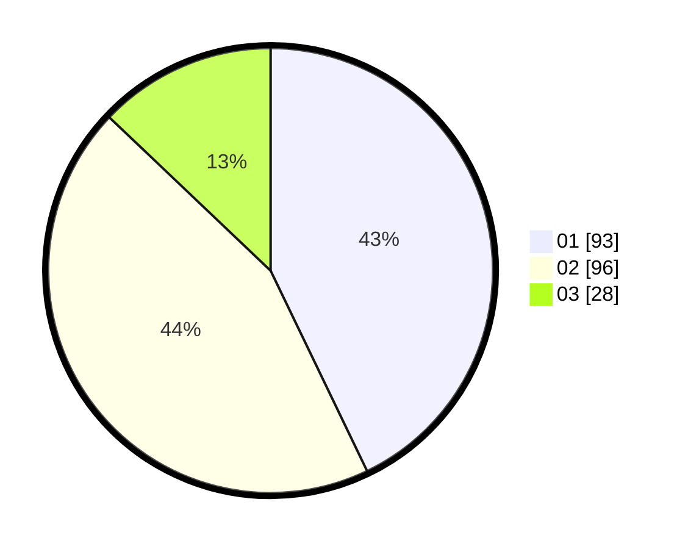

# Hasil

Hasil perolehan suara paslon dapat dilihat pada file paslon-01.txt, paslon-02.txt, dan paslon-03.txt.

Jika tidak ada, artinya data tersebut belum ada pada SIREKAP.

## Perolehan Suara

 * Paslon 01: **93**.
 * Paslon 02: **96**.
 * Paslon 03: **28**.

## Foto C Plano

https://sirekap-obj-formc.kpu.go.id/368a/pemilu/ppwp/31/72/04/10/04/3172041004108-20240214-191259--5bad0ffb-11fd-4e57-baed-933a28e715d0.jpg

https://sirekap-obj-formc.kpu.go.id/368a/pemilu/ppwp/31/72/04/10/04/3172041004108-20240214-191338--2736e8b8-a312-442b-bcbc-7e9becf0fe96.jpg

https://sirekap-obj-formc.kpu.go.id/368a/pemilu/ppwp/31/72/04/10/04/3172041004108-20240214-191358--62fd8551-9fe2-4eeb-a88c-f52705b95a44.jpg

## DATA PEMILIH TETAP

Jumlah pemilih dalam DPT: **285**.
 * L: **145**.
 * P: **140**.

## DATA PENGGUNA HAK PILIH

Jumlah pengguna hak pilih dalam DPT: **219**.
 * L: **110**.
 * P: **109**.

Jumlah pengguna hak pilih dalam DPTb: **0**.
 * L: **0**.
 * P: **0**.

Jumlah pengguna hak pilih dalam DPK: **0**.
 * L: **0**.
 * P: **0**.

Jumlah pengguna hak pilih: **219**.
 * L: **110**.
 * P: **109**.

## JUMLAH SUARA SAH DAN TIDAK SAH

JUMLAH SELURUH SUARA SAH: **217**.

JUMLAH SUARA TIDAK SAH: **2**.

JUMLAH SELURUH SUARA SAH DAN SUARA TIDAK SAH: **219**.
