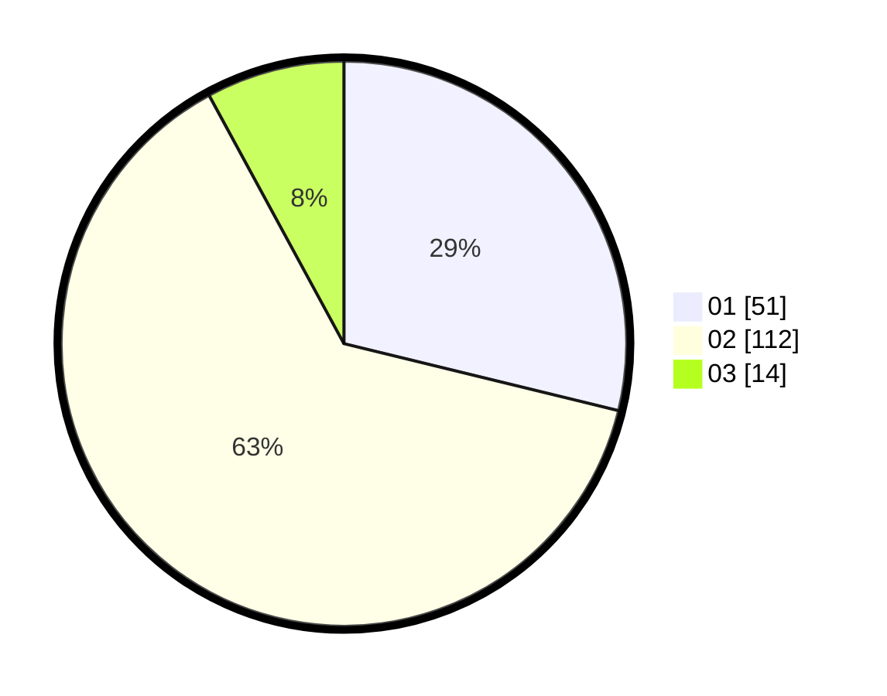

# Hasil

Hasil perolehan suara paslon dapat dilihat pada file paslon-01.txt, paslon-02.txt, dan paslon-03.txt.

Jika tidak ada, artinya data tersebut belum ada pada SIREKAP.

## Perolehan Suara

 * Paslon 01: **51**.
 * Paslon 02: **112**.
 * Paslon 03: **14**.

## Foto C Plano

https://sirekap-obj-formc.kpu.go.id/1722/pemilu/ppwp/31/72/04/10/04/3172041004119-20240214-201036--9101ab8a-4b37-4edb-8501-3f4764c31168.jpg

https://sirekap-obj-formc.kpu.go.id/1722/pemilu/ppwp/31/72/04/10/04/3172041004119-20240214-201124--e007d80a-2c79-4449-a4b5-0f72d62c2400.jpg

https://sirekap-obj-formc.kpu.go.id/1722/pemilu/ppwp/31/72/04/10/04/3172041004119-20240214-212900--6958c6e8-2441-43e1-b351-30143cd83e90.jpg
