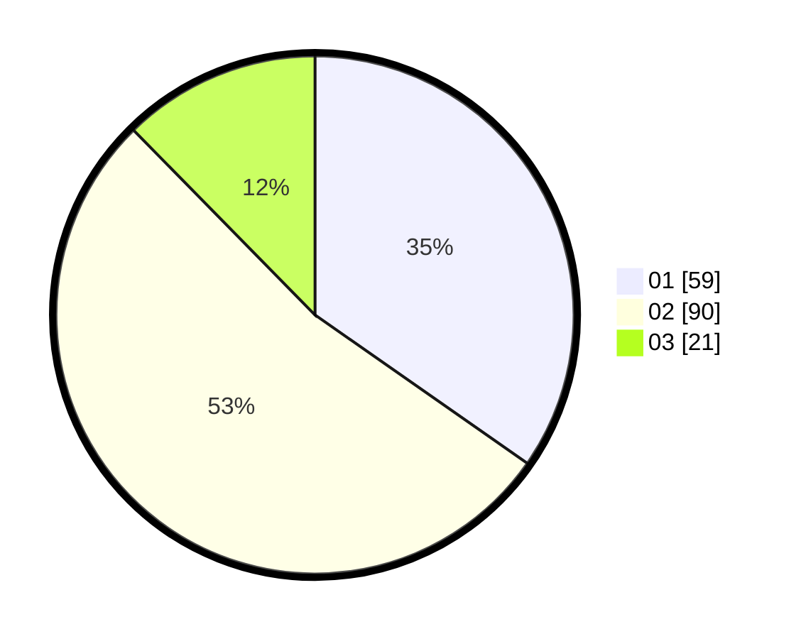

# Hasil

Hasil perolehan suara paslon dapat dilihat pada file paslon-01.txt, paslon-02.txt, dan paslon-03.txt.

Jika tidak ada, artinya data tersebut belum ada pada SIREKAP.

## Perolehan Suara

 * Paslon 01: **59**.
 * Paslon 02: **90**.
 * Paslon 03: **21**.

## Foto C Plano

https://sirekap-obj-formc.kpu.go.id/ce42/pemilu/ppwp/31/72/04/10/04/3172041004156-20240216-004533--ea95d5f2-8d97-4708-9392-6dc9d723a921.jpg

https://sirekap-obj-formc.kpu.go.id/ce42/pemilu/ppwp/31/72/04/10/04/3172041004156-20240216-004536--c1137d65-9e53-41bc-92f9-7ad674205681.jpg

https://sirekap-obj-formc.kpu.go.id/ce42/pemilu/ppwp/31/72/04/10/04/3172041004156-20240216-004535--a3de42c8-9bd3-4d2d-9441-766b43308d75.jpg

## DATA PEMILIH TETAP

Jumlah pemilih dalam DPT: **232**.
 * L: **119**.
 * P: **113**.

## DATA PENGGUNA HAK PILIH

Jumlah pengguna hak pilih dalam DPT: **232**.
 * L: **119**.
 * P: **113**.

Jumlah pengguna hak pilih dalam DPTb: **4**.
 * L: **4**.
 * P: **0**.

Jumlah pengguna hak pilih dalam DPK: **4**.
 * L: **2**.
 * P: **2**.

Jumlah pengguna hak pilih: **240**.
 * L: **125**.
 * P: **115**.

## JUMLAH SUARA SAH DAN TIDAK SAH

JUMLAH SELURUH SUARA SAH: **170**.

JUMLAH SUARA TIDAK SAH: **5**.

JUMLAH SELURUH SUARA SAH DAN SUARA TIDAK SAH: **175**.
