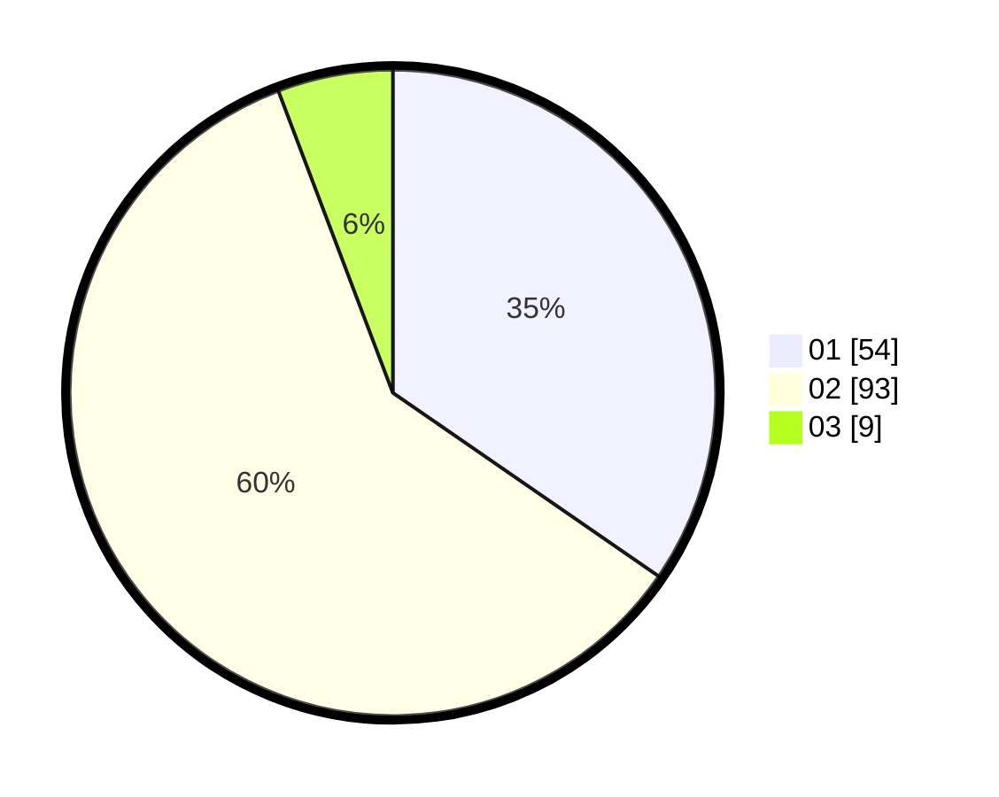

# Hasil

Hasil perolehan suara paslon dapat dilihat pada file paslon-01.txt, paslon-02.txt, dan paslon-03.txt.

Jika tidak ada, artinya data tersebut belum ada pada SIREKAP.

## Perolehan Suara

 * Paslon 01: **54**.
 * Paslon 02: **93**.
 * Paslon 03: **9**.

## Foto C Plano

https://sirekap-obj-formc.kpu.go.id/09e6/pemilu/ppwp/31/72/04/10/04/3172041004160-20240214-221418--a8e3edbb-f297-4239-9fe0-f0adb46c14ff.jpg

https://sirekap-obj-formc.kpu.go.id/09e6/pemilu/ppwp/31/72/04/10/04/3172041004160-20240214-221452--82bfc76e-3bdb-47dd-a578-debe852ffce8.jpg

https://sirekap-obj-formc.kpu.go.id/09e6/pemilu/ppwp/31/72/04/10/04/3172041004160-20240219-205847--07dd7015-93f5-4ad1-89e1-0b2d61304cce.jpg
