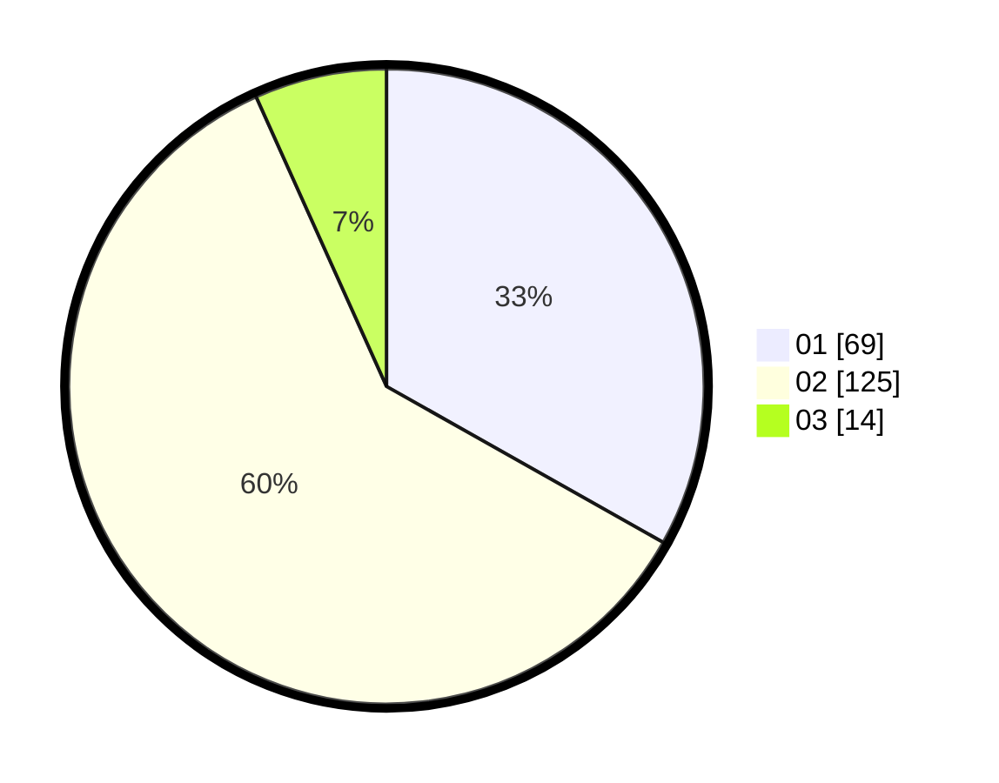

# Hasil

Hasil perolehan suara paslon dapat dilihat pada file paslon-01.txt, paslon-02.txt, dan paslon-03.txt.

Jika tidak ada, artinya data tersebut belum ada pada SIREKAP.

## Perolehan Suara

 * Paslon 01: **69**.
 * Paslon 02: **125**.
 * Paslon 03: **14**.

## Foto C Plano

https://sirekap-obj-formc.kpu.go.id/7423/pemilu/ppwp/31/72/04/10/04/3172041004165-20240214-215919--155a74e7-ddd2-4de8-a03b-cb5eaf4ed212.jpg

https://sirekap-obj-formc.kpu.go.id/7423/pemilu/ppwp/31/72/04/10/04/3172041004165-20240214-191430--06ac5e01-a81e-4af9-b186-a735f56a51ee.jpg

https://sirekap-obj-formc.kpu.go.id/7423/pemilu/ppwp/31/72/04/10/04/3172041004165-20240214-191436--a32a0c0f-184a-4462-aa70-5096cc4137a5.jpg

## DATA PEMILIH TETAP

Jumlah pemilih dalam DPT: **285**.
 * L: **136**.
 * P: **149**.

## DATA PENGGUNA HAK PILIH

Jumlah pengguna hak pilih dalam DPT: **210**.
 * L: **96**.
 * P: **114**.

Jumlah pengguna hak pilih dalam DPTb: **0**.
 * L: **0**.
 * P: **0**.

Jumlah pengguna hak pilih dalam DPK: **1**.
 * L: **1**.
 * P: **0**.

Jumlah pengguna hak pilih: **211**.
 * L: **97**.
 * P: **114**.

## JUMLAH SUARA SAH DAN TIDAK SAH

JUMLAH SELURUH SUARA SAH: **208**.

JUMLAH SUARA TIDAK SAH: **3**.

JUMLAH SELURUH SUARA SAH DAN SUARA TIDAK SAH: **211**.
