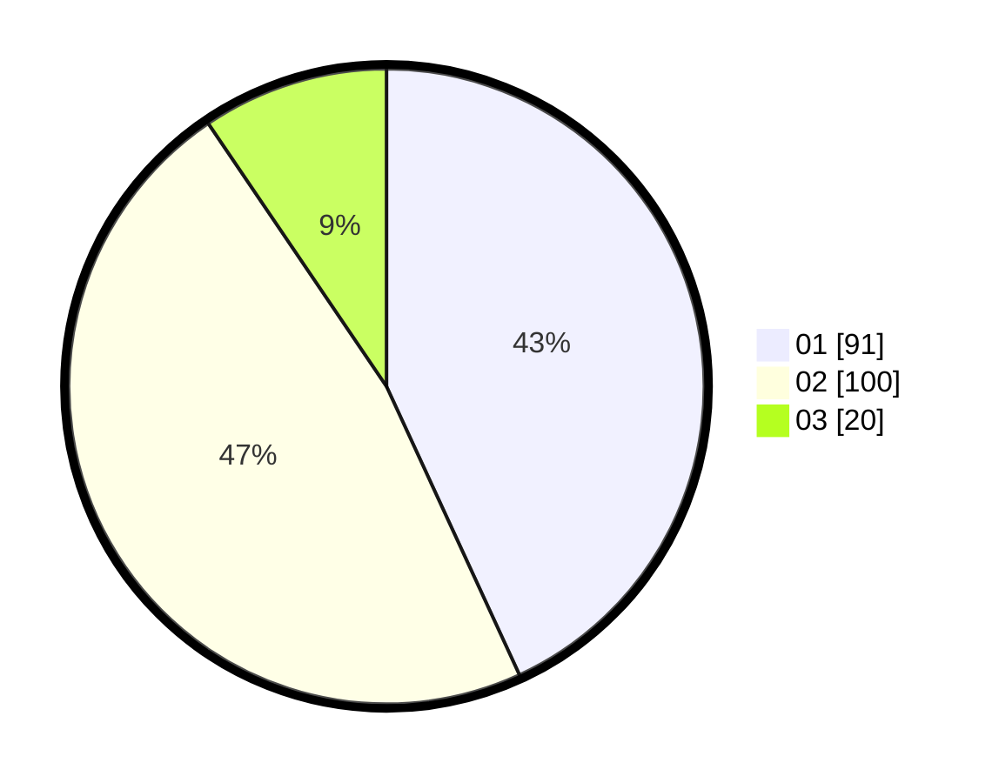

# Hasil

Hasil perolehan suara paslon dapat dilihat pada file paslon-01.txt, paslon-02.txt, dan paslon-03.txt.

Jika tidak ada, artinya data tersebut belum ada pada SIREKAP.

## Perolehan Suara

 * Paslon 01: **91**.
 * Paslon 02: **100**.
 * Paslon 03: **20**.

## Foto C Plano

https://sirekap-obj-formc.kpu.go.id/3b60/pemilu/ppwp/31/72/04/10/04/3172041004191-20240214-155030--569408c0-0e93-4d38-a8df-3b2abaa4aafa.jpg

https://sirekap-obj-formc.kpu.go.id/3b60/pemilu/ppwp/31/72/04/10/04/3172041004191-20240214-155534--6f9d09a9-3173-4c64-a901-da9197b697e2.jpg

https://sirekap-obj-formc.kpu.go.id/3b60/pemilu/ppwp/31/72/04/10/04/3172041004191-20240214-155832--125767e4-b3c1-46fc-afa6-5c2e8942f30d.jpg

## DATA PEMILIH TETAP

Jumlah pemilih dalam DPT: **287**.
 * L: **140**.
 * P: **147**.

## DATA PENGGUNA HAK PILIH

Jumlah pengguna hak pilih dalam DPT: **223**.
 * L: **108**.
 * P: **115**.

Jumlah pengguna hak pilih dalam DPTb: **0**.
 * L: **0**.
 * P: **0**.

Jumlah pengguna hak pilih dalam DPK: **0**.
 * L: **0**.
 * P: **0**.

Jumlah pengguna hak pilih: **223**.
 * L: **108**.
 * P: **115**.

## JUMLAH SUARA SAH DAN TIDAK SAH

JUMLAH SELURUH SUARA SAH: **211**.

JUMLAH SUARA TIDAK SAH: **12**.

JUMLAH SELURUH SUARA SAH DAN SUARA TIDAK SAH: **223**.
