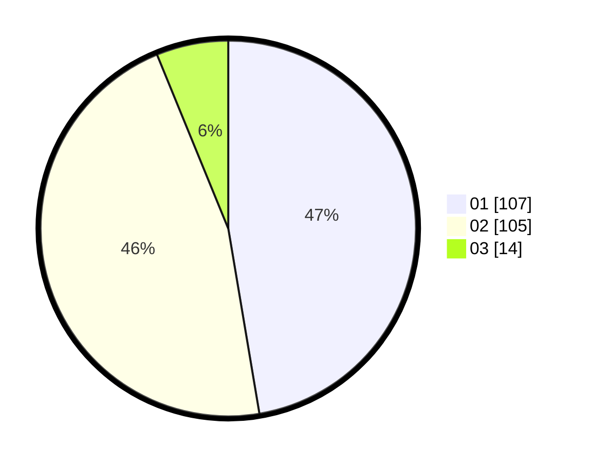

# Hasil

Hasil perolehan suara paslon dapat dilihat pada file paslon-01.txt, paslon-02.txt, dan paslon-03.txt.

Jika tidak ada, artinya data tersebut belum ada pada SIREKAP.

## Perolehan Suara

 * Paslon 01: **107**.
 * Paslon 02: **105**.
 * Paslon 03: **14**.

## Foto C Plano

https://sirekap-obj-formc.kpu.go.id/9bc2/pemilu/ppwp/31/72/04/10/04/3172041004214-20240214-184635--674367c6-cefd-45fd-ae60-670b95d31cf5.jpg

https://sirekap-obj-formc.kpu.go.id/9bc2/pemilu/ppwp/31/72/04/10/04/3172041004214-20240214-155419--44da027d-f95b-4a9d-b35b-e1cd0b5efa5f.jpg

https://sirekap-obj-formc.kpu.go.id/9bc2/pemilu/ppwp/31/72/04/10/04/3172041004214-20240214-155702--d3fe8723-9bcf-46de-8e52-74ff2f2fa9e1.jpg

## DATA PEMILIH TETAP

Jumlah pemilih dalam DPT: **293**.
 * L: **152**.
 * P: **141**.

## DATA PENGGUNA HAK PILIH

Jumlah pengguna hak pilih dalam DPT: **232**.
 * L: **112**.
 * P: **120**.

Jumlah pengguna hak pilih dalam DPTb: **0**.
 * L: **0**.
 * P: **0**.

Jumlah pengguna hak pilih dalam DPK: **2**.
 * L: **1**.
 * P: **1**.

Jumlah pengguna hak pilih: **234**.
 * L: **113**.
 * P: **121**.

## JUMLAH SUARA SAH DAN TIDAK SAH

JUMLAH SELURUH SUARA SAH: **226**.

JUMLAH SUARA TIDAK SAH: **8**.

JUMLAH SELURUH SUARA SAH DAN SUARA TIDAK SAH: **234**.
