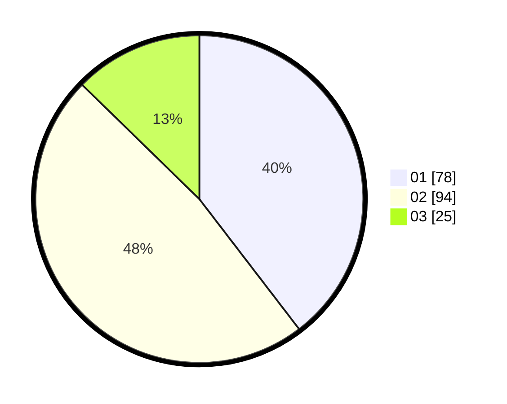

# Hasil

Hasil perolehan suara paslon dapat dilihat pada file paslon-01.txt, paslon-02.txt, dan paslon-03.txt.

Jika tidak ada, artinya data tersebut belum ada pada SIREKAP.

## Perolehan Suara

 * Paslon 01: **78**.
 * Paslon 02: **94**.
 * Paslon 03: **25**.

## Foto C Plano

https://sirekap-obj-formc.kpu.go.id/e223/pemilu/ppwp/31/72/04/10/05/3172041005005-20240214-194026--d58126be-599b-4872-95fd-68247901650e.jpg

https://sirekap-obj-formc.kpu.go.id/e223/pemilu/ppwp/31/72/04/10/05/3172041005005-20240214-194032--050ecdcc-981e-4a84-9f2f-d24a884db9d9.jpg

https://sirekap-obj-formc.kpu.go.id/e223/pemilu/ppwp/31/72/04/10/05/3172041005005-20240214-194037--ba507ef4-0321-443e-82f6-746e67d1a95d.jpg

## DATA PEMILIH TETAP

Jumlah pemilih dalam DPT: **292**.
 * L: **123**.
 * P: **169**.

## DATA PENGGUNA HAK PILIH

Jumlah pengguna hak pilih dalam DPT: **202**.
 * L: **78**.
 * P: **124**.

Jumlah pengguna hak pilih dalam DPTb: **1**.
 * L: **0**.
 * P: **1**.

Jumlah pengguna hak pilih dalam DPK: **3**.
 * L: **1**.
 * P: **2**.

Jumlah pengguna hak pilih: **206**.
 * L: **79**.
 * P: **127**.

## JUMLAH SUARA SAH DAN TIDAK SAH

JUMLAH SELURUH SUARA SAH: **147**.

JUMLAH SUARA TIDAK SAH: **7**.

JUMLAH SELURUH SUARA SAH DAN SUARA TIDAK SAH: **206**.
