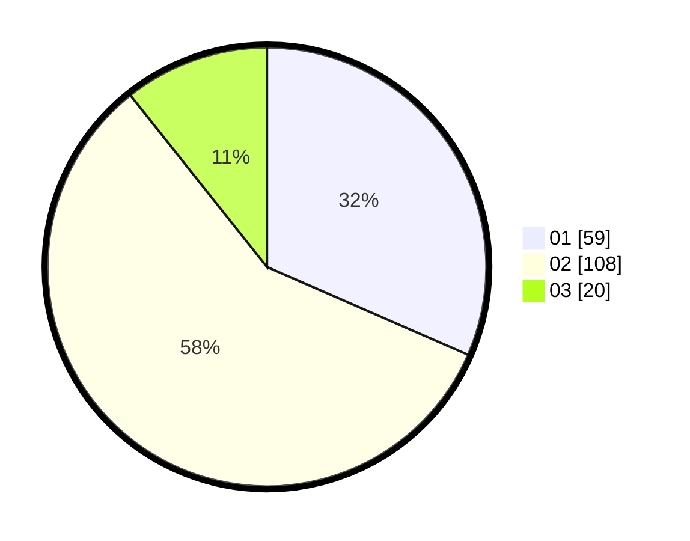

# Hasil

Hasil perolehan suara paslon dapat dilihat pada file paslon-01.txt, paslon-02.txt, dan paslon-03.txt.

Jika tidak ada, artinya data tersebut belum ada pada SIREKAP.

## Perolehan Suara

 * Paslon 01: **59**.
 * Paslon 02: **108**.
 * Paslon 03: **20**.

## Foto C Plano

https://sirekap-obj-formc.kpu.go.id/66d3/pemilu/ppwp/31/72/04/10/05/3172041005009-20240214-190547--41893eee-bc0c-49d0-859a-33a040f796e3.jpg

https://sirekap-obj-formc.kpu.go.id/66d3/pemilu/ppwp/31/72/04/10/05/3172041005009-20240214-195746--e204f5e4-f63f-418b-8ae4-299fcda6feb0.jpg

https://sirekap-obj-formc.kpu.go.id/66d3/pemilu/ppwp/31/72/04/10/05/3172041005009-20240214-204852--8415e2b4-e967-4519-946d-51b38a008024.jpg

## DATA PEMILIH TETAP

Jumlah pemilih dalam DPT: **280**.
 * L: **129**.
 * P: **151**.

## DATA PENGGUNA HAK PILIH

Jumlah pengguna hak pilih dalam DPT: **188**.
 * L: **81**.
 * P: **107**.

Jumlah pengguna hak pilih dalam DPTb: **0**.
 * L: **0**.
 * P: **0**.

Jumlah pengguna hak pilih dalam DPK: **1**.
 * L: **0**.
 * P: **1**.

Jumlah pengguna hak pilih: **189**.
 * L: **81**.
 * P: **108**.

## JUMLAH SUARA SAH DAN TIDAK SAH

JUMLAH SELURUH SUARA SAH: **187**.

JUMLAH SUARA TIDAK SAH: **2**.

JUMLAH SELURUH SUARA SAH DAN SUARA TIDAK SAH: **189**.
