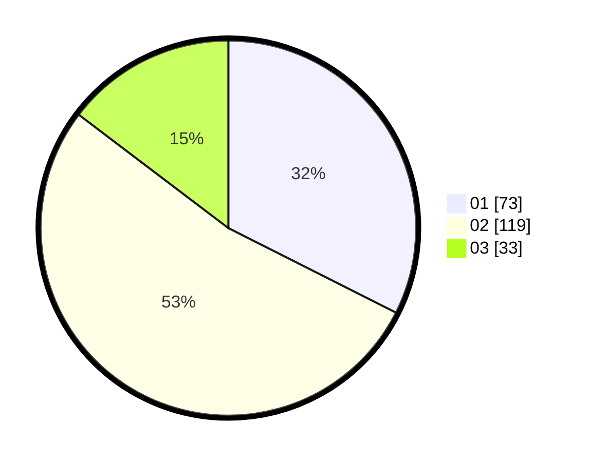

# Hasil

Hasil perolehan suara paslon dapat dilihat pada file paslon-01.txt, paslon-02.txt, dan paslon-03.txt.

Jika tidak ada, artinya data tersebut belum ada pada SIREKAP.

## Perolehan Suara

 * Paslon 01: **73**.
 * Paslon 02: **119**.
 * Paslon 03: **33**.

## Foto C Plano

https://sirekap-obj-formc.kpu.go.id/b69b/pemilu/ppwp/31/72/04/10/05/3172041005025-20240214-185518--723ebb78-4034-45a3-b8b1-fa80e9351ba3.jpg

https://sirekap-obj-formc.kpu.go.id/b69b/pemilu/ppwp/31/72/04/10/05/3172041005025-20240214-185800--a65c2cfe-17ab-46fc-818e-01c9a3841240.jpg

https://sirekap-obj-formc.kpu.go.id/b69b/pemilu/ppwp/31/72/04/10/05/3172041005025-20240214-185913--5ec8e9b2-9d25-4e0a-9fe8-5dba857b0c6b.jpg

## DATA PEMILIH TETAP

Jumlah pemilih dalam DPT: **288**.
 * L: **139**.
 * P: **149**.

## DATA PENGGUNA HAK PILIH

Jumlah pengguna hak pilih dalam DPT: **228**.
 * L: **100**.
 * P: **128**.

Jumlah pengguna hak pilih dalam DPTb: **1**.
 * L: **0**.
 * P: **1**.

Jumlah pengguna hak pilih dalam DPK: **1**.
 * L: **1**.
 * P: **0**.

Jumlah pengguna hak pilih: **230**.
 * L: **101**.
 * P: **129**.

## JUMLAH SUARA SAH DAN TIDAK SAH

JUMLAH SELURUH SUARA SAH: **225**.

JUMLAH SUARA TIDAK SAH: **5**.

JUMLAH SELURUH SUARA SAH DAN SUARA TIDAK SAH: **230**.
