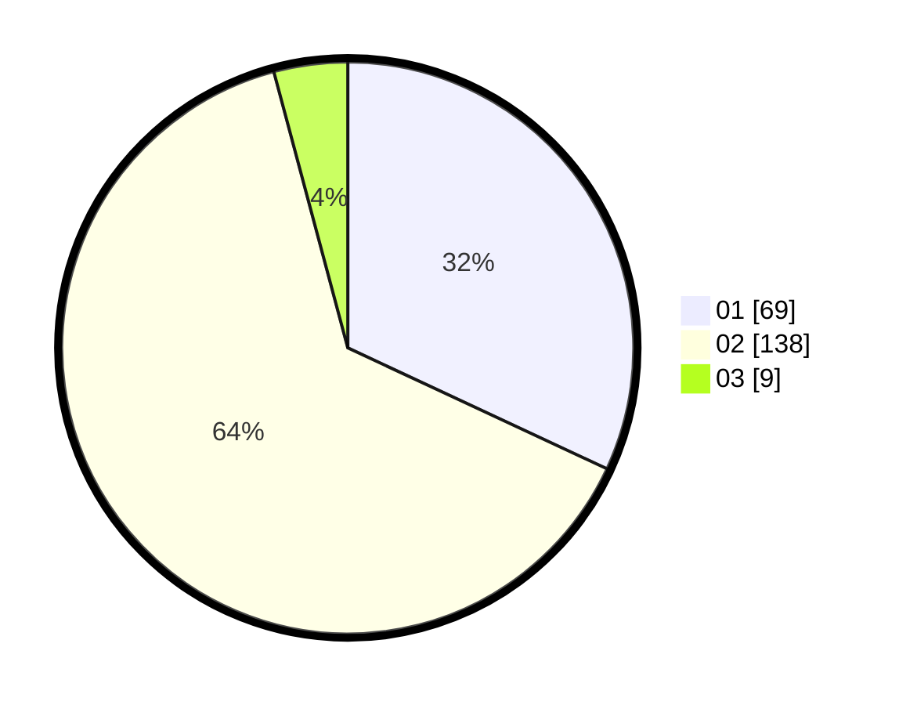

# Hasil

Hasil perolehan suara paslon dapat dilihat pada file paslon-01.txt, paslon-02.txt, dan paslon-03.txt.

Jika tidak ada, artinya data tersebut belum ada pada SIREKAP.

## Perolehan Suara

 * Paslon 01: **69**.
 * Paslon 02: **138**.
 * Paslon 03: **9**.

## Foto C Plano

https://sirekap-obj-formc.kpu.go.id/1f89/pemilu/ppwp/31/72/04/10/05/3172041005029-20240214-155546--419cc26c-d59b-4ee5-a025-dbe9ec58efd8.jpg

https://sirekap-obj-formc.kpu.go.id/1f89/pemilu/ppwp/31/72/04/10/05/3172041005029-20240214-155914--f9263166-8fd1-4629-a748-b84d0ca11265.jpg

https://sirekap-obj-formc.kpu.go.id/1f89/pemilu/ppwp/31/72/04/10/05/3172041005029-20240214-195050--292b9c63-e7e6-4a72-8bd5-3b06e5bf1273.jpg

## DATA PEMILIH TETAP

Jumlah pemilih dalam DPT: **290**.
 * L: **143**.
 * P: **147**.

## DATA PENGGUNA HAK PILIH

Jumlah pengguna hak pilih dalam DPT: **218**.
 * L: **104**.
 * P: **114**.

Jumlah pengguna hak pilih dalam DPTb: **0**.
 * L: **0**.
 * P: **0**.

Jumlah pengguna hak pilih dalam DPK: **3**.
 * L: **3**.
 * P: **0**.

Jumlah pengguna hak pilih: **221**.
 * L: **107**.
 * P: **114**.

## JUMLAH SUARA SAH DAN TIDAK SAH

JUMLAH SELURUH SUARA SAH: **216**.

JUMLAH SUARA TIDAK SAH: **5**.

JUMLAH SELURUH SUARA SAH DAN SUARA TIDAK SAH: **221**.
