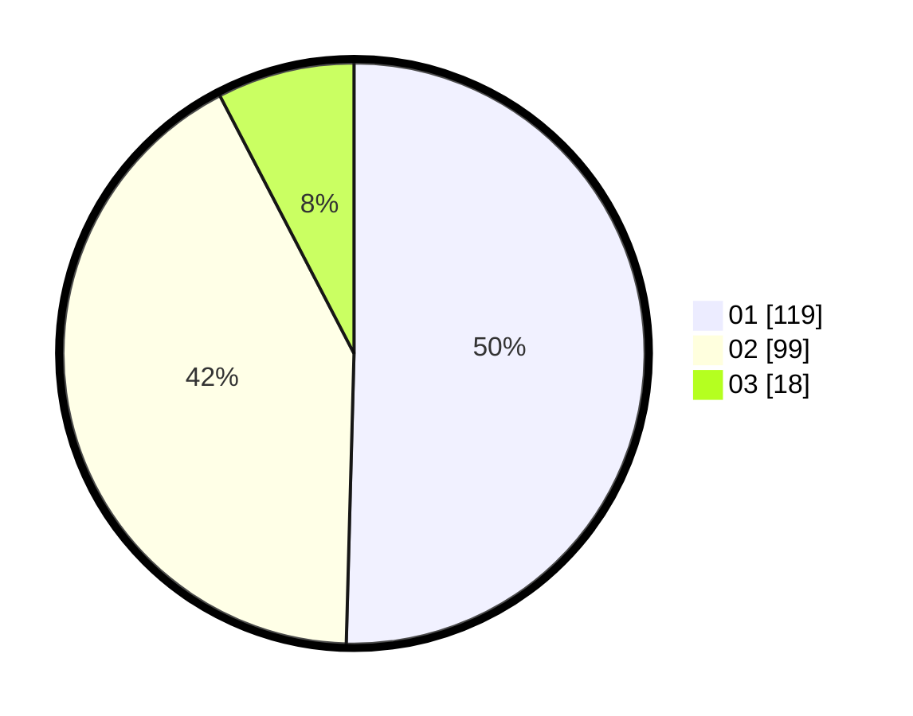

# Hasil

Hasil perolehan suara paslon dapat dilihat pada file paslon-01.txt, paslon-02.txt, dan paslon-03.txt.

Jika tidak ada, artinya data tersebut belum ada pada SIREKAP.

## Perolehan Suara

 * Paslon 01: **119**.
 * Paslon 02: **99**.
 * Paslon 03: **18**.

## Foto C Plano

https://sirekap-obj-formc.kpu.go.id/edc8/pemilu/ppwp/31/72/04/10/05/3172041005031-20240214-194811--4c48b56e-3282-4f17-a954-375bdfd5e21e.jpg

https://sirekap-obj-formc.kpu.go.id/edc8/pemilu/ppwp/31/72/04/10/05/3172041005031-20240214-195237--01b65dfa-9d73-4b92-b1c6-764ac1254c47.jpg

https://sirekap-obj-formc.kpu.go.id/edc8/pemilu/ppwp/31/72/04/10/05/3172041005031-20240214-195510--1e51b294-f8da-4f4b-90fc-3e0d2b31783f.jpg

## DATA PEMILIH TETAP

Jumlah pemilih dalam DPT: **286**.
 * L: **147**.
 * P: **139**.

## DATA PENGGUNA HAK PILIH

Jumlah pengguna hak pilih dalam DPT: **238**.
 * L: **117**.
 * P: **121**.

Jumlah pengguna hak pilih dalam DPTb: **2**.
 * L: **0**.
 * P: **2**.

Jumlah pengguna hak pilih dalam DPK: **0**.
 * L: **0**.
 * P: **0**.

Jumlah pengguna hak pilih: **240**.
 * L: **117**.
 * P: **123**.

## JUMLAH SUARA SAH DAN TIDAK SAH

JUMLAH SELURUH SUARA SAH: **236**.

JUMLAH SUARA TIDAK SAH: **4**.

JUMLAH SELURUH SUARA SAH DAN SUARA TIDAK SAH: **240**.
