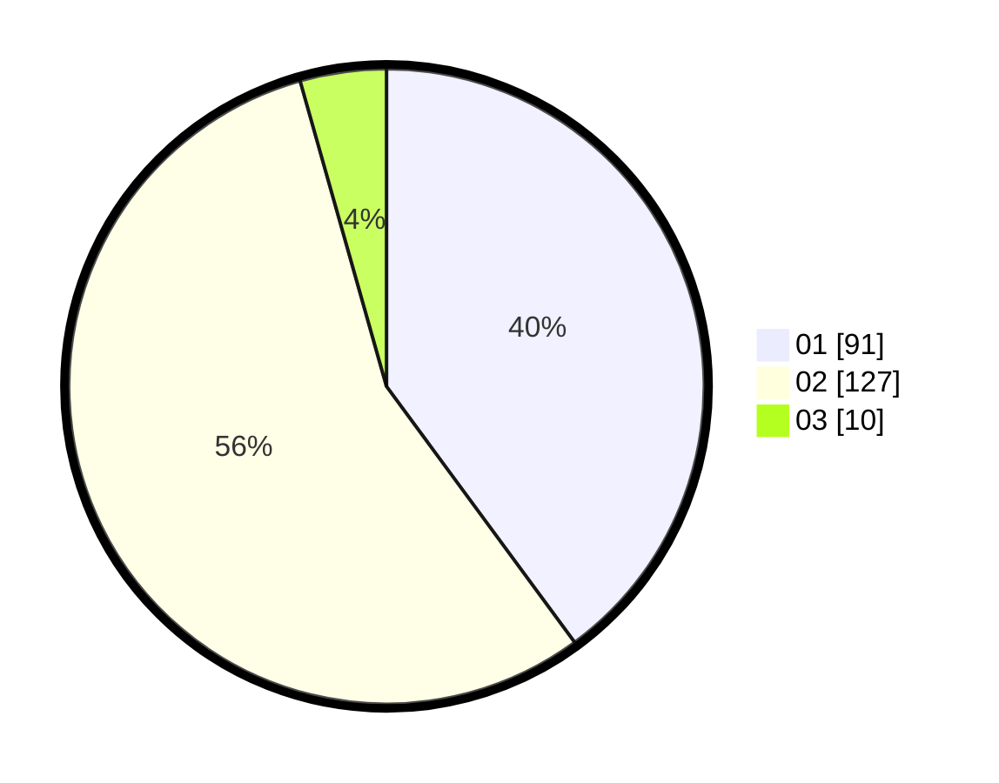

# Hasil

Hasil perolehan suara paslon dapat dilihat pada file paslon-01.txt, paslon-02.txt, dan paslon-03.txt.

Jika tidak ada, artinya data tersebut belum ada pada SIREKAP.

## Perolehan Suara

 * Paslon 01: **91**.
 * Paslon 02: **127**.
 * Paslon 03: **10**.

## Foto C Plano

https://sirekap-obj-formc.kpu.go.id/6b15/pemilu/ppwp/31/72/04/10/05/3172041005034-20240214-155556--9adb1822-6f1d-424b-8f3e-97332c3f9ecb.jpg

https://sirekap-obj-formc.kpu.go.id/6b15/pemilu/ppwp/31/72/04/10/05/3172041005034-20240214-155254--986735b6-0aab-4a85-9e7a-33e8427f08ef.jpg

https://sirekap-obj-formc.kpu.go.id/6b15/pemilu/ppwp/31/72/04/10/05/3172041005034-20240214-194856--258f839c-0613-4e42-bb76-a88b892ae3f7.jpg
