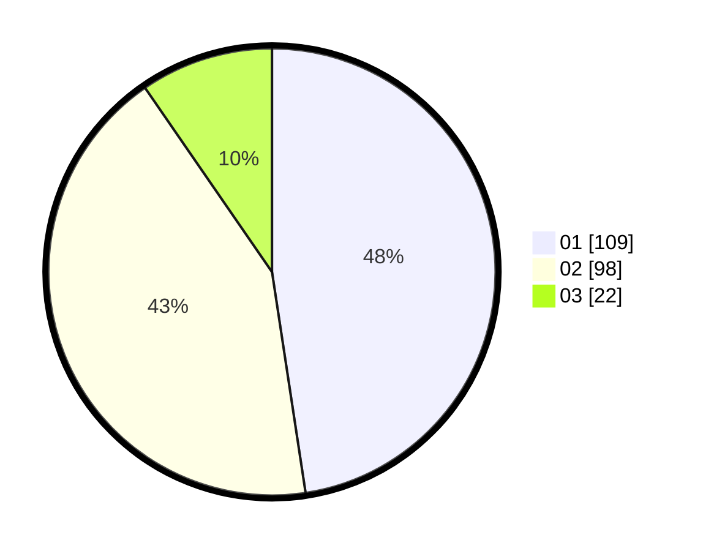

# Hasil

Hasil perolehan suara paslon dapat dilihat pada file paslon-01.txt, paslon-02.txt, dan paslon-03.txt.

Jika tidak ada, artinya data tersebut belum ada pada SIREKAP.

## Perolehan Suara

 * Paslon 01: **109**.
 * Paslon 02: **98**.
 * Paslon 03: **22**.

## Foto C Plano

https://sirekap-obj-formc.kpu.go.id/17a8/pemilu/ppwp/31/72/04/10/05/3172041005037-20240214-160127--022d9566-f7cd-4bbe-ad74-38563143dbe1.jpg

https://sirekap-obj-formc.kpu.go.id/17a8/pemilu/ppwp/31/72/04/10/05/3172041005037-20240214-155845--0cdfee66-8c33-4dc4-9e3a-8e17fbe6b93e.jpg

https://sirekap-obj-formc.kpu.go.id/17a8/pemilu/ppwp/31/72/04/10/05/3172041005037-20240214-160140--bba878e7-7319-4662-aeda-aac29149d80f.jpg

## DATA PEMILIH TETAP

Jumlah pemilih dalam DPT: **295**.
 * L: **157**.
 * P: **138**.

## DATA PENGGUNA HAK PILIH

Jumlah pengguna hak pilih dalam DPT: **231**.
 * L: **120**.
 * P: **111**.

Jumlah pengguna hak pilih dalam DPTb: **1**.
 * L: **1**.
 * P: **0**.

Jumlah pengguna hak pilih dalam DPK: **1**.
 * L: **0**.
 * P: **1**.

Jumlah pengguna hak pilih: **233**.
 * L: **121**.
 * P: **112**.

## JUMLAH SUARA SAH DAN TIDAK SAH

JUMLAH SELURUH SUARA SAH: **229**.

JUMLAH SUARA TIDAK SAH: **4**.

JUMLAH SELURUH SUARA SAH DAN SUARA TIDAK SAH: **233**.
