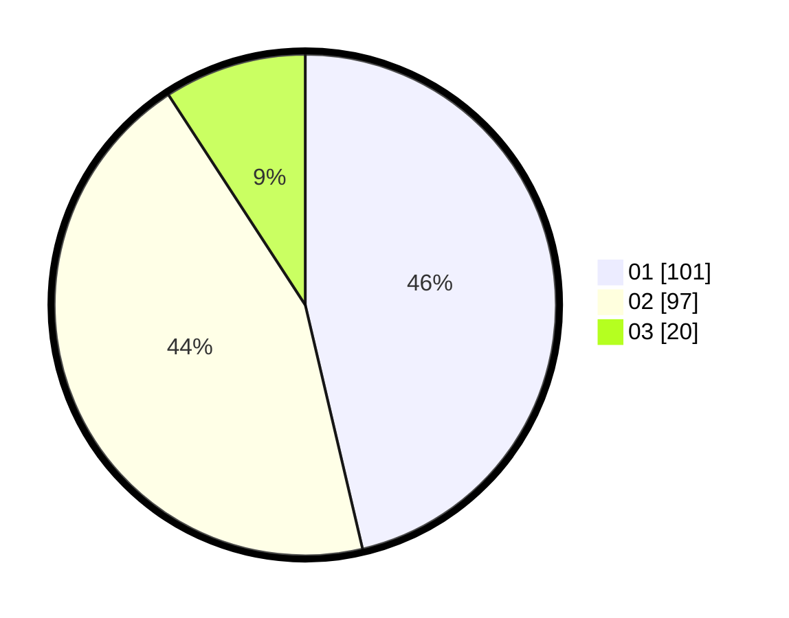

# Hasil

Hasil perolehan suara paslon dapat dilihat pada file paslon-01.txt, paslon-02.txt, dan paslon-03.txt.

Jika tidak ada, artinya data tersebut belum ada pada SIREKAP.

## Perolehan Suara

 * Paslon 01: **101**.
 * Paslon 02: **97**.
 * Paslon 03: **20**.

## Foto C Plano

https://sirekap-obj-formc.kpu.go.id/7515/pemilu/ppwp/31/72/04/10/05/3172041005038-20240215-164153--7657aae3-b6b3-4d53-b813-50cf855dc9d2.jpg

https://sirekap-obj-formc.kpu.go.id/7515/pemilu/ppwp/31/72/04/10/05/3172041005038-20240215-164215--3efafbe9-44a9-4b0d-a71e-395d28209173.jpg

https://sirekap-obj-formc.kpu.go.id/7515/pemilu/ppwp/31/72/04/10/05/3172041005038-20240215-164203--720f7bd3-5a48-4368-a66e-c7b62c48e41d.jpg

## DATA PEMILIH TETAP

Jumlah pemilih dalam DPT: **225**.
 * L: **110**.
 * P: **115**.

## DATA PENGGUNA HAK PILIH

Jumlah pengguna hak pilih dalam DPT: **292**.
 * L: **147**.
 * P: **145**.

Jumlah pengguna hak pilih dalam DPTb: **1**.
 * L: **1**.
 * P: **0**.

Jumlah pengguna hak pilih dalam DPK: **2**.
 * L: **1**.
 * P: **1**.

Jumlah pengguna hak pilih: **295**.
 * L: **149**.
 * P: **146**.

## JUMLAH SUARA SAH DAN TIDAK SAH

JUMLAH SELURUH SUARA SAH: **218**.

JUMLAH SUARA TIDAK SAH: **7**.

JUMLAH SELURUH SUARA SAH DAN SUARA TIDAK SAH: **225**.
