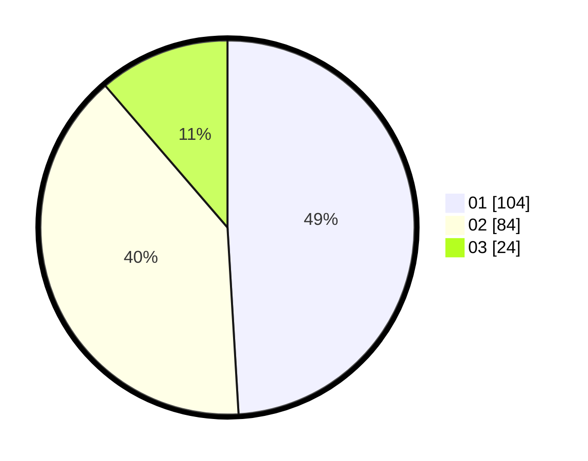

# Hasil

Hasil perolehan suara paslon dapat dilihat pada file paslon-01.txt, paslon-02.txt, dan paslon-03.txt.

Jika tidak ada, artinya data tersebut belum ada pada SIREKAP.

## Perolehan Suara

 * Paslon 01: **104**.
 * Paslon 02: **84**.
 * Paslon 03: **24**.

## Foto C Plano

https://sirekap-obj-formc.kpu.go.id/2a16/pemilu/ppwp/31/72/04/10/05/3172041005039-20240214-191819--fd63101d-01a7-4e63-978f-cb1a427746cb.jpg

https://sirekap-obj-formc.kpu.go.id/2a16/pemilu/ppwp/31/72/04/10/05/3172041005039-20240214-191833--42ebfdb1-726c-4094-baca-1785cfba2738.jpg

https://sirekap-obj-formc.kpu.go.id/2a16/pemilu/ppwp/31/72/04/10/05/3172041005039-20240214-191854--b84d548d-f40c-4c75-9528-b849a2defb8b.jpg

## DATA PEMILIH TETAP

Jumlah pemilih dalam DPT: **284**.
 * L: **141**.
 * P: **143**.

## DATA PENGGUNA HAK PILIH

Jumlah pengguna hak pilih dalam DPT: **212**.
 * L: **93**.
 * P: **119**.

Jumlah pengguna hak pilih dalam DPTb: **1**.
 * L: **1**.
 * P: **0**.

Jumlah pengguna hak pilih dalam DPK: **1**.
 * L: **0**.
 * P: **1**.

Jumlah pengguna hak pilih: **214**.
 * L: **94**.
 * P: **120**.

## JUMLAH SUARA SAH DAN TIDAK SAH

JUMLAH SELURUH SUARA SAH: **212**.

JUMLAH SUARA TIDAK SAH: **2**.

JUMLAH SELURUH SUARA SAH DAN SUARA TIDAK SAH: **214**.
