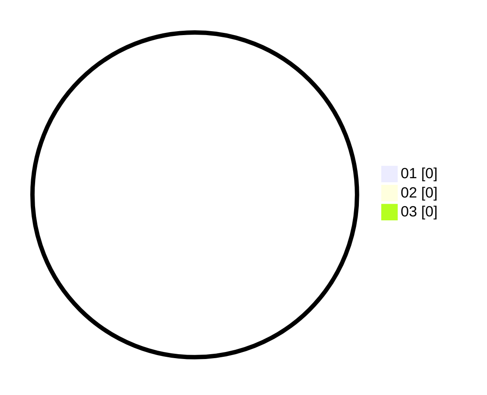

# Hasil

Hasil perolehan suara paslon dapat dilihat pada file paslon-01.txt, paslon-02.txt, dan paslon-03.txt.

Jika tidak ada, artinya data tersebut belum ada pada SIREKAP.

## Perolehan Suara

 * Paslon 01: **0**.
 * Paslon 02: **0**.
 * Paslon 03: **0**.

## Foto C Plano

https://sirekap-obj-formc.kpu.go.id/2aea/pemilu/ppwp/31/72/04/10/05/3172041005045-20240214-184742--0590199a-e1eb-4d43-8661-9bec5f35dfbd.jpg

https://sirekap-obj-formc.kpu.go.id/2aea/pemilu/ppwp/31/72/04/10/05/3172041005045-20240214-184748--694f5730-66d6-4c93-b6e1-9dfd4d164368.jpg

https://sirekap-obj-formc.kpu.go.id/2aea/pemilu/ppwp/31/72/04/10/05/3172041005045-20240214-184752--0610e9f3-2bfa-4603-861e-f495953874f4.jpg

## DATA PEMILIH TETAP

Jumlah pemilih dalam DPT: **282**.
 * L: **135**.
 * P: **147**.

## DATA PENGGUNA HAK PILIH

Jumlah pengguna hak pilih dalam DPT: **207**.
 * L: **91**.
 * P: **116**.

Jumlah pengguna hak pilih dalam DPTb: **7**.
 * L: **4**.
 * P: **3**.

Jumlah pengguna hak pilih dalam DPK: **0**.
 * L: **0**.
 * P: **0**.

Jumlah pengguna hak pilih: **214**.
 * L: **95**.
 * P: **119**.

## JUMLAH SUARA SAH DAN TIDAK SAH

JUMLAH SELURUH SUARA SAH: **212**.

JUMLAH SUARA TIDAK SAH: **2**.

JUMLAH SELURUH SUARA SAH DAN SUARA TIDAK SAH: **214**.
