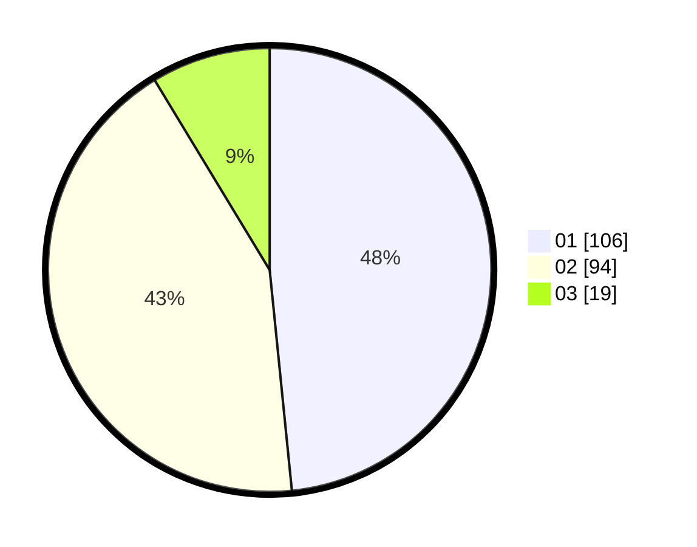

# Hasil

Hasil perolehan suara paslon dapat dilihat pada file paslon-01.txt, paslon-02.txt, dan paslon-03.txt.

Jika tidak ada, artinya data tersebut belum ada pada SIREKAP.

## Perolehan Suara

 * Paslon 01: **106**.
 * Paslon 02: **94**.
 * Paslon 03: **19**.

## Foto C Plano

https://sirekap-obj-formc.kpu.go.id/50f0/pemilu/ppwp/31/72/04/10/05/3172041005048-20240214-141711--10f3920f-4c8b-4d70-bd44-f8de59926499.jpg

https://sirekap-obj-formc.kpu.go.id/50f0/pemilu/ppwp/31/72/04/10/05/3172041005048-20240215-214500--5a08ca8e-fe02-4fe1-8563-188773bb1cf0.jpg

https://sirekap-obj-formc.kpu.go.id/50f0/pemilu/ppwp/31/72/04/10/05/3172041005048-20240214-141816--fa8364cc-08f5-4e54-b2da-57d19d50a88e.jpg

## DATA PEMILIH TETAP

Jumlah pemilih dalam DPT: **278**.
 * L: **132**.
 * P: **146**.

## DATA PENGGUNA HAK PILIH

Jumlah pengguna hak pilih dalam DPT: **218**.
 * L: **102**.
 * P: **116**.

Jumlah pengguna hak pilih dalam DPTb: **3**.
 * L: **1**.
 * P: **2**.

Jumlah pengguna hak pilih dalam DPK: **0**.
 * L: **0**.
 * P: **0**.

Jumlah pengguna hak pilih: **221**.
 * L: **103**.
 * P: **118**.

## JUMLAH SUARA SAH DAN TIDAK SAH

JUMLAH SELURUH SUARA SAH: **219**.

JUMLAH SUARA TIDAK SAH: **2**.

JUMLAH SELURUH SUARA SAH DAN SUARA TIDAK SAH: **221**.
