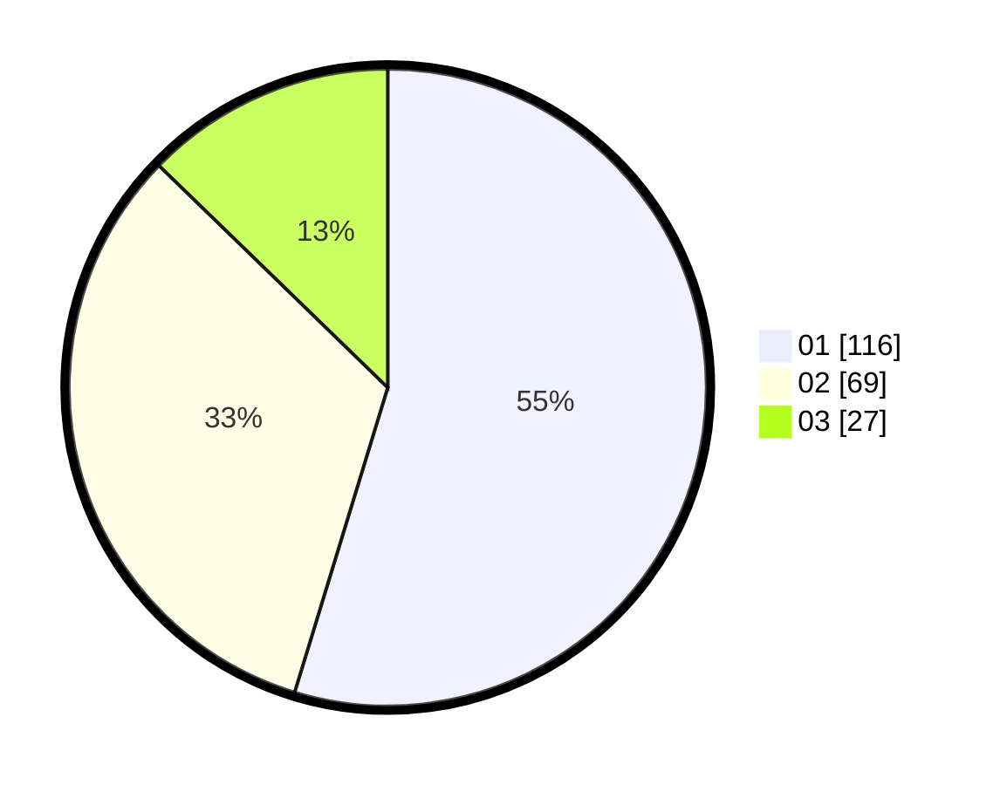

# Hasil

Hasil perolehan suara paslon dapat dilihat pada file paslon-01.txt, paslon-02.txt, dan paslon-03.txt.

Jika tidak ada, artinya data tersebut belum ada pada SIREKAP.

## Perolehan Suara

 * Paslon 01: **116**.
 * Paslon 02: **69**.
 * Paslon 03: **27**.

## Foto C Plano

https://sirekap-obj-formc.kpu.go.id/91c2/pemilu/ppwp/31/72/04/10/05/3172041005070-20240214-210211--4bea025f-970f-4373-a7ec-4d44f1d165bd.jpg

https://sirekap-obj-formc.kpu.go.id/91c2/pemilu/ppwp/31/72/04/10/05/3172041005070-20240214-210525--821cdc33-1c09-4d4a-b882-72ee4e33d186.jpg

https://sirekap-obj-formc.kpu.go.id/91c2/pemilu/ppwp/31/72/04/10/05/3172041005070-20240214-210710--720405b3-894e-437b-9f38-517bd82ad85b.jpg

## DATA PEMILIH TETAP

Jumlah pemilih dalam DPT: **285**.
 * L: **136**.
 * P: **149**.

## DATA PENGGUNA HAK PILIH

Jumlah pengguna hak pilih dalam DPT: **210**.
 * L: **98**.
 * P: **112**.

Jumlah pengguna hak pilih dalam DPTb: **0**.
 * L: **0**.
 * P: **0**.

Jumlah pengguna hak pilih dalam DPK: **4**.
 * L: **1**.
 * P: **3**.

Jumlah pengguna hak pilih: **214**.
 * L: **99**.
 * P: **115**.

## JUMLAH SUARA SAH DAN TIDAK SAH

JUMLAH SELURUH SUARA SAH: **212**.

JUMLAH SUARA TIDAK SAH: **2**.

JUMLAH SELURUH SUARA SAH DAN SUARA TIDAK SAH: **214**.
