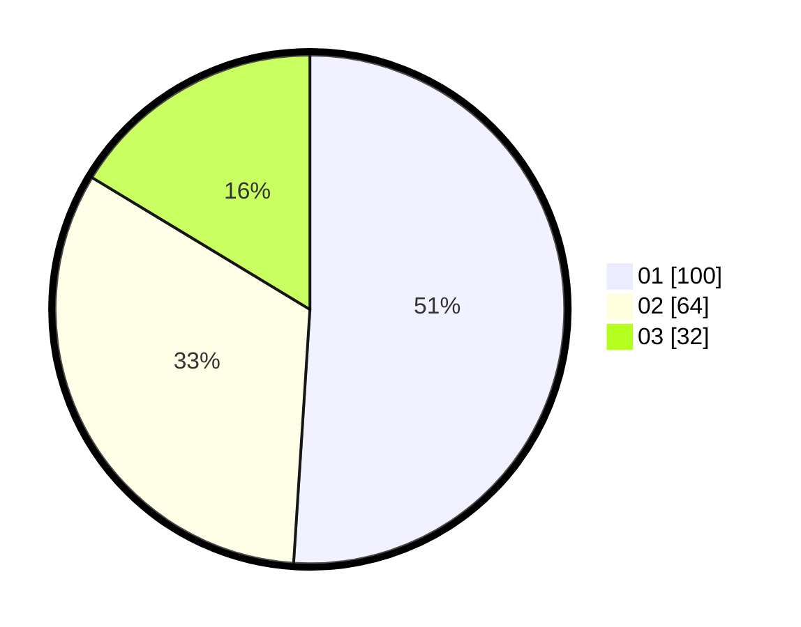

# Hasil

Hasil perolehan suara paslon dapat dilihat pada file paslon-01.txt, paslon-02.txt, dan paslon-03.txt.

Jika tidak ada, artinya data tersebut belum ada pada SIREKAP.

## Perolehan Suara

 * Paslon 01: **100**.
 * Paslon 02: **64**.
 * Paslon 03: **32**.

## Foto C Plano

https://sirekap-obj-formc.kpu.go.id/a30d/pemilu/ppwp/31/72/04/10/05/3172041005074-20240214-192822--ab53ecdd-2a65-442b-afbb-26e234cc63ad.jpg

https://sirekap-obj-formc.kpu.go.id/a30d/pemilu/ppwp/31/72/04/10/05/3172041005074-20240214-192836--de0625a0-02e7-4499-839c-7ebaf9fec1e9.jpg

https://sirekap-obj-formc.kpu.go.id/a30d/pemilu/ppwp/31/72/04/10/05/3172041005074-20240214-192842--e69b074e-ec2d-42f1-a433-615ae7e6dc5c.jpg

## DATA PEMILIH TETAP

Jumlah pemilih dalam DPT: **191**.
 * L: **86**.
 * P: **105**.

## DATA PENGGUNA HAK PILIH

Jumlah pengguna hak pilih dalam DPT: **191**.
 * L: **86**.
 * P: **105**.

Jumlah pengguna hak pilih dalam DPTb: **0**.
 * L: **0**.
 * P: **0**.

Jumlah pengguna hak pilih dalam DPK: **6**.
 * L: **4**.
 * P: **2**.

Jumlah pengguna hak pilih: **197**.
 * L: **90**.
 * P: **107**.

## JUMLAH SUARA SAH DAN TIDAK SAH

JUMLAH SELURUH SUARA SAH: **196**.

JUMLAH SUARA TIDAK SAH: **1**.

JUMLAH SELURUH SUARA SAH DAN SUARA TIDAK SAH: **197**.
