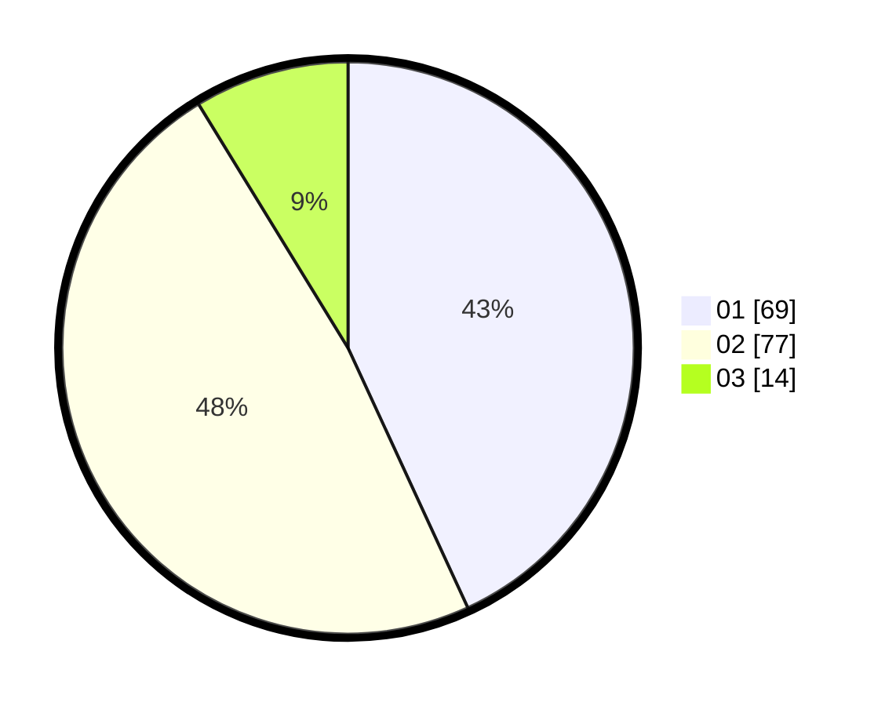

# Hasil

Hasil perolehan suara paslon dapat dilihat pada file paslon-01.txt, paslon-02.txt, dan paslon-03.txt.

Jika tidak ada, artinya data tersebut belum ada pada SIREKAP.

## Perolehan Suara

 * Paslon 01: **69**.
 * Paslon 02: **77**.
 * Paslon 03: **14**.

## Foto C Plano

https://sirekap-obj-formc.kpu.go.id/385d/pemilu/ppwp/31/72/04/10/05/3172041005075-20240214-184520--bfaa4a76-dca9-48ba-b084-5470eea8d9b9.jpg

https://sirekap-obj-formc.kpu.go.id/385d/pemilu/ppwp/31/72/04/10/05/3172041005075-20240214-184512--b41196fd-c317-4212-bb7e-5f5da9e22617.jpg

https://sirekap-obj-formc.kpu.go.id/385d/pemilu/ppwp/31/72/04/10/05/3172041005075-20240214-184421--6bab0e03-c011-4ae6-8983-5506a6fe0c9c.jpg

## DATA PEMILIH TETAP

Jumlah pemilih dalam DPT: **203**.
 * L: **101**.
 * P: **102**.

## DATA PENGGUNA HAK PILIH

Jumlah pengguna hak pilih dalam DPT: **162**.
 * L: **80**.
 * P: **82**.

Jumlah pengguna hak pilih dalam DPTb: **0**.
 * L: **0**.
 * P: **0**.

Jumlah pengguna hak pilih dalam DPK: **0**.
 * L: **0**.
 * P: **0**.

Jumlah pengguna hak pilih: **162**.
 * L: **80**.
 * P: **82**.

## JUMLAH SUARA SAH DAN TIDAK SAH

JUMLAH SELURUH SUARA SAH: **160**.

JUMLAH SUARA TIDAK SAH: **2**.

JUMLAH SELURUH SUARA SAH DAN SUARA TIDAK SAH: **162**.
