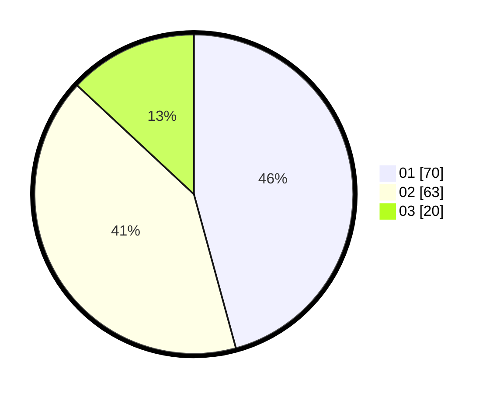

# Hasil

Hasil perolehan suara paslon dapat dilihat pada file paslon-01.txt, paslon-02.txt, dan paslon-03.txt.

Jika tidak ada, artinya data tersebut belum ada pada SIREKAP.

## Perolehan Suara

 * Paslon 01: **70**.
 * Paslon 02: **63**.
 * Paslon 03: **20**.

## Foto C Plano

https://sirekap-obj-formc.kpu.go.id/522c/pemilu/ppwp/31/72/04/10/05/3172041005076-20240214-224843--b5156125-77ef-4ce0-9848-22824f43445a.jpg

https://sirekap-obj-formc.kpu.go.id/522c/pemilu/ppwp/31/72/04/10/05/3172041005076-20240214-225150--4f2bca9e-ef4c-4131-a7b3-a46405e7dd00.jpg

https://sirekap-obj-formc.kpu.go.id/522c/pemilu/ppwp/31/72/04/10/05/3172041005076-20240214-225218--a77b5136-1a6b-41a8-a4b5-d9d1a3ba5746.jpg
