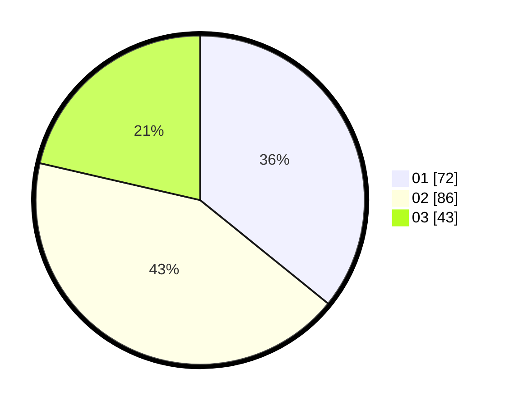

# Hasil

Hasil perolehan suara paslon dapat dilihat pada file paslon-01.txt, paslon-02.txt, dan paslon-03.txt.

Jika tidak ada, artinya data tersebut belum ada pada SIREKAP.

## Perolehan Suara

 * Paslon 01: **72**.
 * Paslon 02: **86**.
 * Paslon 03: **43**.

## Foto C Plano

https://sirekap-obj-formc.kpu.go.id/1a5e/pemilu/ppwp/31/72/04/10/05/3172041005077-20240214-232216--e143e5ba-9aba-44ae-85ae-d2694cd8da0f.jpg

https://sirekap-obj-formc.kpu.go.id/1a5e/pemilu/ppwp/31/72/04/10/05/3172041005077-20240214-232311--9d3ea8df-1665-4dca-a3f5-bf5394a9ad4c.jpg

https://sirekap-obj-formc.kpu.go.id/1a5e/pemilu/ppwp/31/72/04/10/05/3172041005077-20240214-232352--9aa7ea83-c9e4-46d9-8ce1-ad1def05245e.jpg

## DATA PEMILIH TETAP

Jumlah pemilih dalam DPT: **267**.
 * L: **122**.
 * P: **145**.

## DATA PENGGUNA HAK PILIH

Jumlah pengguna hak pilih dalam DPT: **201**.
 * L: **89**.
 * P: **112**.

Jumlah pengguna hak pilih dalam DPTb: **1**.
 * L: **0**.
 * P: **1**.

Jumlah pengguna hak pilih dalam DPK: **3**.
 * L: **3**.
 * P: **0**.

Jumlah pengguna hak pilih: **205**.
 * L: **92**.
 * P: **113**.

## JUMLAH SUARA SAH DAN TIDAK SAH

JUMLAH SELURUH SUARA SAH: **201**.

JUMLAH SUARA TIDAK SAH: **4**.

JUMLAH SELURUH SUARA SAH DAN SUARA TIDAK SAH: **205**.
