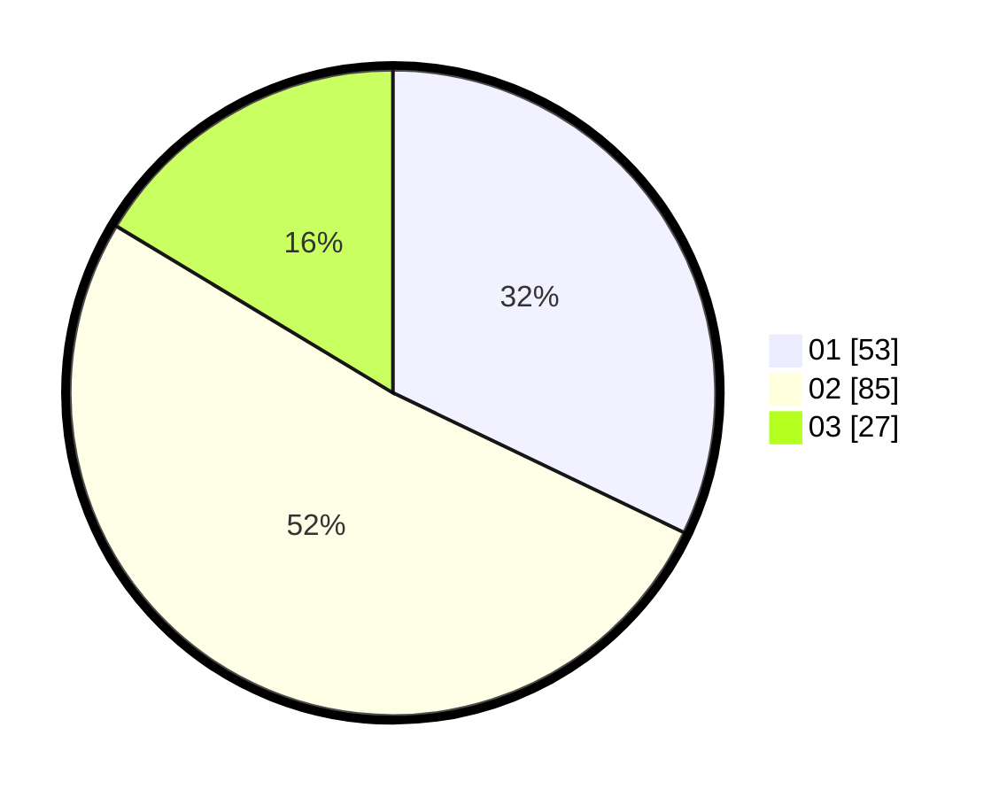

# Hasil

Hasil perolehan suara paslon dapat dilihat pada file paslon-01.txt, paslon-02.txt, dan paslon-03.txt.

Jika tidak ada, artinya data tersebut belum ada pada SIREKAP.

## Perolehan Suara

 * Paslon 01: **53**.
 * Paslon 02: **85**.
 * Paslon 03: **27**.

## Foto C Plano

https://sirekap-obj-formc.kpu.go.id/947a/pemilu/ppwp/31/72/04/10/05/3172041005078-20240214-230846--0fd4f7e5-bcb7-4beb-b841-d3b872727fe5.jpg

https://sirekap-obj-formc.kpu.go.id/947a/pemilu/ppwp/31/72/04/10/05/3172041005078-20240214-230851--1af87a96-06e2-41bd-91c7-077cca24729f.jpg

https://sirekap-obj-formc.kpu.go.id/947a/pemilu/ppwp/31/72/04/10/05/3172041005078-20240214-230856--06a7b36b-9802-4744-b781-a0860ac87498.jpg
