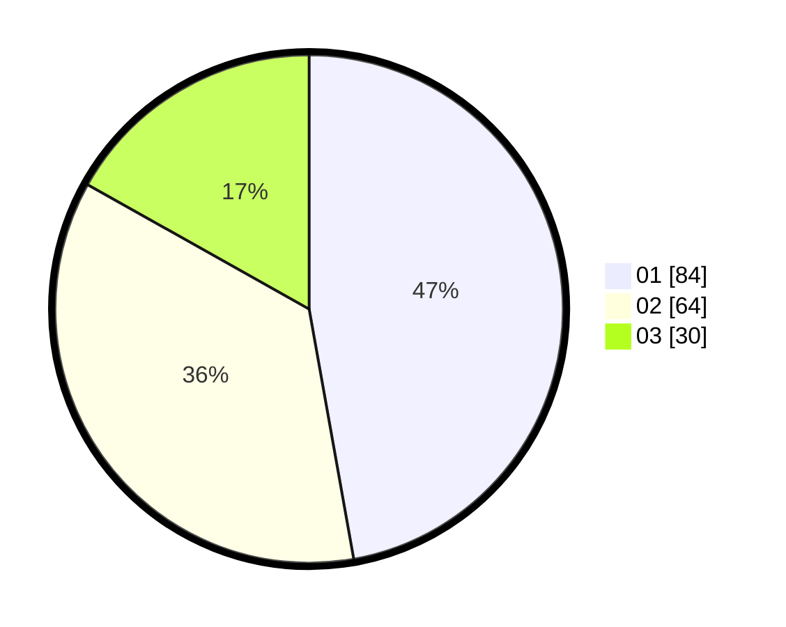

# Hasil

Hasil perolehan suara paslon dapat dilihat pada file paslon-01.txt, paslon-02.txt, dan paslon-03.txt.

Jika tidak ada, artinya data tersebut belum ada pada SIREKAP.

## Perolehan Suara

 * Paslon 01: **84**.
 * Paslon 02: **64**.
 * Paslon 03: **30**.

## Foto C Plano

https://sirekap-obj-formc.kpu.go.id/9ef0/pemilu/ppwp/31/72/04/10/05/3172041005080-20240214-231557--a0893c16-0361-4d34-b1b8-b42743c3b9b6.jpg

https://sirekap-obj-formc.kpu.go.id/9ef0/pemilu/ppwp/31/72/04/10/05/3172041005080-20240214-231920--036ca948-de05-4a9b-87f0-ba25a5c5f92f.jpg

https://sirekap-obj-formc.kpu.go.id/9ef0/pemilu/ppwp/31/72/04/10/05/3172041005080-20240214-231754--2e22e663-84ad-40e9-8ecb-ebd29caab5cd.jpg

## DATA PEMILIH TETAP

Jumlah pemilih dalam DPT: **238**.
 * L: **102**.
 * P: **136**.

## DATA PENGGUNA HAK PILIH

Jumlah pengguna hak pilih dalam DPT: **176**.
 * L: **71**.
 * P: **105**.

Jumlah pengguna hak pilih dalam DPTb: **0**.
 * L: **0**.
 * P: **0**.

Jumlah pengguna hak pilih dalam DPK: **4**.
 * L: **2**.
 * P: **2**.

Jumlah pengguna hak pilih: **180**.
 * L: **73**.
 * P: **107**.

## JUMLAH SUARA SAH DAN TIDAK SAH

JUMLAH SELURUH SUARA SAH: **178**.

JUMLAH SUARA TIDAK SAH: **2**.

JUMLAH SELURUH SUARA SAH DAN SUARA TIDAK SAH: **180**.
