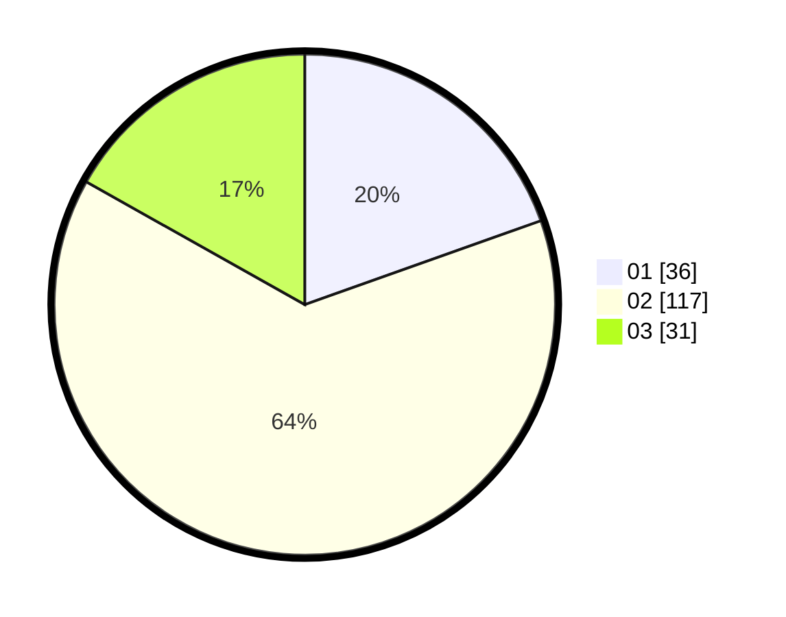

# Hasil

Hasil perolehan suara paslon dapat dilihat pada file paslon-01.txt, paslon-02.txt, dan paslon-03.txt.

Jika tidak ada, artinya data tersebut belum ada pada SIREKAP.

## Perolehan Suara

 * Paslon 01: **36**.
 * Paslon 02: **117**.
 * Paslon 03: **31**.

## Foto C Plano

https://sirekap-obj-formc.kpu.go.id/817f/pemilu/ppwp/31/72/04/10/05/3172041005083-20240214-230204--78321888-413a-4ec6-806d-9bfcdf8d4a66.jpg

https://sirekap-obj-formc.kpu.go.id/817f/pemilu/ppwp/31/72/04/10/05/3172041005083-20240214-202011--611cffc0-cc35-4df5-937f-cb2010b05dd3.jpg

https://sirekap-obj-formc.kpu.go.id/817f/pemilu/ppwp/31/72/04/10/05/3172041005083-20240214-212924--1a4fd18d-b60c-4ff0-bb35-520f917092d7.jpg

## DATA PEMILIH TETAP

Jumlah pemilih dalam DPT: **248**.
 * L: **109**.
 * P: **139**.

## DATA PENGGUNA HAK PILIH

Jumlah pengguna hak pilih dalam DPT: **183**.
 * L: **77**.
 * P: **106**.

Jumlah pengguna hak pilih dalam DPTb: **2**.
 * L: **0**.
 * P: **2**.

Jumlah pengguna hak pilih dalam DPK: **3**.
 * L: **0**.
 * P: **3**.

Jumlah pengguna hak pilih: **188**.
 * L: **77**.
 * P: **111**.

## JUMLAH SUARA SAH DAN TIDAK SAH

JUMLAH SELURUH SUARA SAH: **184**.

JUMLAH SUARA TIDAK SAH: **4**.

JUMLAH SELURUH SUARA SAH DAN SUARA TIDAK SAH: **188**.
