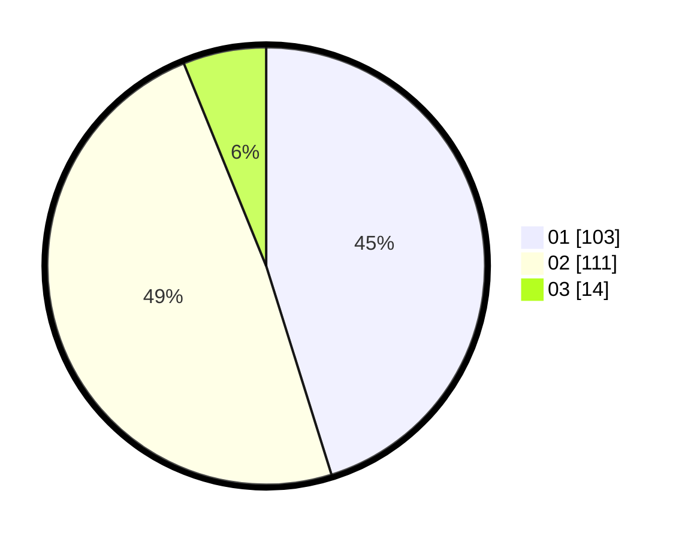

# Hasil

Hasil perolehan suara paslon dapat dilihat pada file paslon-01.txt, paslon-02.txt, dan paslon-03.txt.

Jika tidak ada, artinya data tersebut belum ada pada SIREKAP.

## Perolehan Suara

 * Paslon 01: **103**.
 * Paslon 02: **111**.
 * Paslon 03: **14**.

## Foto C Plano

https://sirekap-obj-formc.kpu.go.id/69bc/pemilu/ppwp/31/72/04/10/05/3172041005093-20240216-172843--f46c49f0-28cf-4a84-b7c6-9a1564933c88.jpg

https://sirekap-obj-formc.kpu.go.id/69bc/pemilu/ppwp/31/72/04/10/05/3172041005093-20240214-155419--8f0dec28-836b-4909-b2b5-550729ce1013.jpg

https://sirekap-obj-formc.kpu.go.id/69bc/pemilu/ppwp/31/72/04/10/05/3172041005093-20240214-155653--a3bd309f-3f3f-4de6-892c-ad556ed17411.jpg

## DATA PEMILIH TETAP

Jumlah pemilih dalam DPT: **282**.
 * L: **151**.
 * P: **131**.

## DATA PENGGUNA HAK PILIH

Jumlah pengguna hak pilih dalam DPT: **225**.
 * L: **119**.
 * P: **106**.

Jumlah pengguna hak pilih dalam DPTb: **1**.
 * L: **0**.
 * P: **1**.

Jumlah pengguna hak pilih dalam DPK: **4**.
 * L: **3**.
 * P: **1**.

Jumlah pengguna hak pilih: **230**.
 * L: **122**.
 * P: **108**.

## JUMLAH SUARA SAH DAN TIDAK SAH

JUMLAH SELURUH SUARA SAH: **228**.

JUMLAH SUARA TIDAK SAH: **2**.

JUMLAH SELURUH SUARA SAH DAN SUARA TIDAK SAH: **230**.
