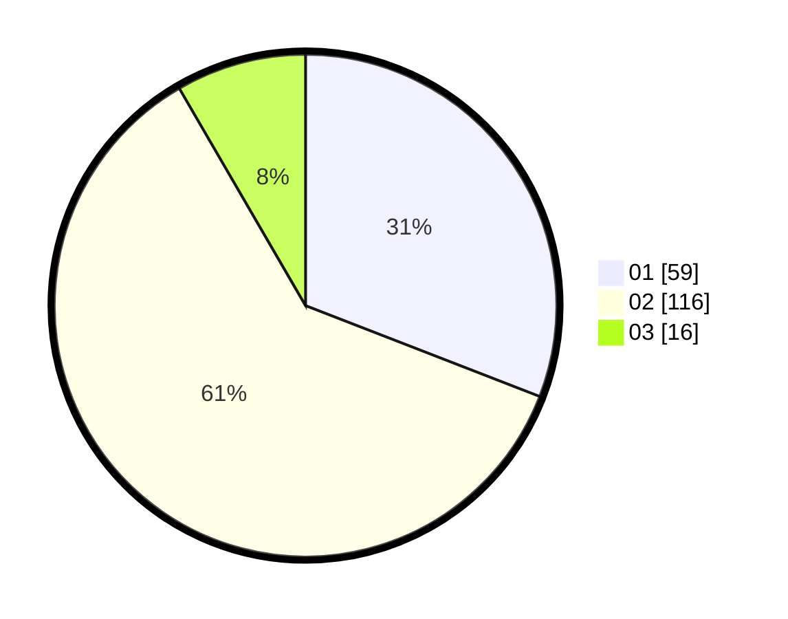

# Hasil

Hasil perolehan suara paslon dapat dilihat pada file paslon-01.txt, paslon-02.txt, dan paslon-03.txt.

Jika tidak ada, artinya data tersebut belum ada pada SIREKAP.

## Perolehan Suara

 * Paslon 01: **59**.
 * Paslon 02: **116**.
 * Paslon 03: **16**.

## Foto C Plano

https://sirekap-obj-formc.kpu.go.id/9cdc/pemilu/ppwp/31/72/04/10/05/3172041005101-20240214-155023--b86508c5-4722-4d37-bb1c-8bc2e0f98336.jpg

https://sirekap-obj-formc.kpu.go.id/9cdc/pemilu/ppwp/31/72/04/10/05/3172041005101-20240214-214215--95aeade8-7ff1-40d3-8bff-b248faaac632.jpg

https://sirekap-obj-formc.kpu.go.id/9cdc/pemilu/ppwp/31/72/04/10/05/3172041005101-20240214-214442--cffc2aec-476f-4202-abf0-35b35b6b6441.jpg

## DATA PEMILIH TETAP

Jumlah pemilih dalam DPT: **292**.
 * L: **143**.
 * P: **149**.

## DATA PENGGUNA HAK PILIH

Jumlah pengguna hak pilih dalam DPT: **191**.
 * L: **90**.
 * P: **101**.

Jumlah pengguna hak pilih dalam DPTb: **1**.
 * L: **0**.
 * P: **1**.

Jumlah pengguna hak pilih dalam DPK: **1**.
 * L: **0**.
 * P: **1**.

Jumlah pengguna hak pilih: **193**.
 * L: **90**.
 * P: **103**.

## JUMLAH SUARA SAH DAN TIDAK SAH

JUMLAH SELURUH SUARA SAH: **191**.

JUMLAH SUARA TIDAK SAH: **2**.

JUMLAH SELURUH SUARA SAH DAN SUARA TIDAK SAH: **193**.
