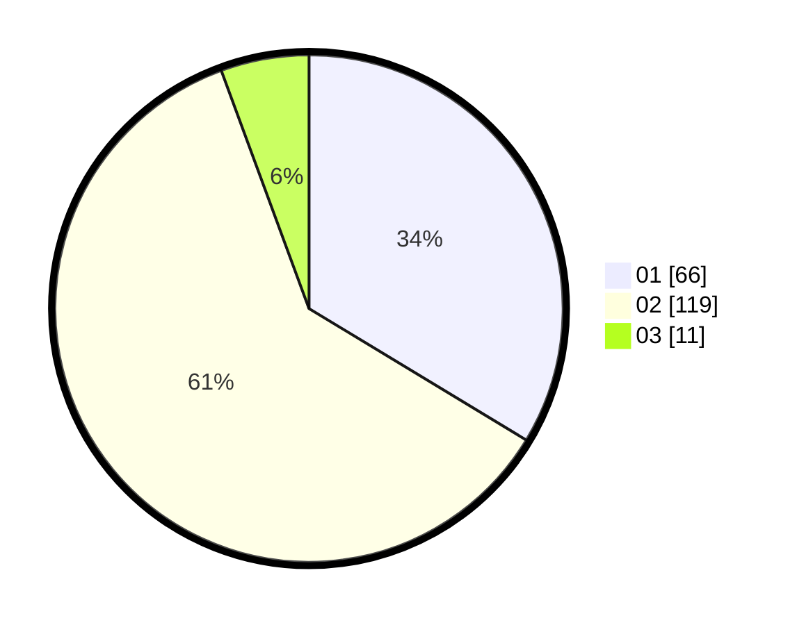

# Hasil

Hasil perolehan suara paslon dapat dilihat pada file paslon-01.txt, paslon-02.txt, dan paslon-03.txt.

Jika tidak ada, artinya data tersebut belum ada pada SIREKAP.

## Perolehan Suara

 * Paslon 01: **66**.
 * Paslon 02: **119**.
 * Paslon 03: **11**.

## Foto C Plano

https://sirekap-obj-formc.kpu.go.id/f2f6/pemilu/ppwp/31/72/04/10/05/3172041005104-20240214-193911--f1db15ca-afde-4ef0-b65a-59fdcdf5d4bf.jpg

https://sirekap-obj-formc.kpu.go.id/f2f6/pemilu/ppwp/31/72/04/10/05/3172041005104-20240214-195353--b5098d82-3343-480b-b450-550cef5f11c0.jpg

https://sirekap-obj-formc.kpu.go.id/f2f6/pemilu/ppwp/31/72/04/10/05/3172041005104-20240214-195038--d5331c52-58f1-40ad-940b-033054880b23.jpg

## DATA PEMILIH TETAP

Jumlah pemilih dalam DPT: **279**.
 * L: **142**.
 * P: **137**.

## DATA PENGGUNA HAK PILIH

Jumlah pengguna hak pilih dalam DPT: **189**.
 * L: **92**.
 * P: **97**.

Jumlah pengguna hak pilih dalam DPTb: **3**.
 * L: **2**.
 * P: **1**.

Jumlah pengguna hak pilih dalam DPK: **6**.
 * L: **1**.
 * P: **5**.

Jumlah pengguna hak pilih: **198**.
 * L: **95**.
 * P: **103**.

## JUMLAH SUARA SAH DAN TIDAK SAH

JUMLAH SELURUH SUARA SAH: **196**.

JUMLAH SUARA TIDAK SAH: **3**.

JUMLAH SELURUH SUARA SAH DAN SUARA TIDAK SAH: **199**.
