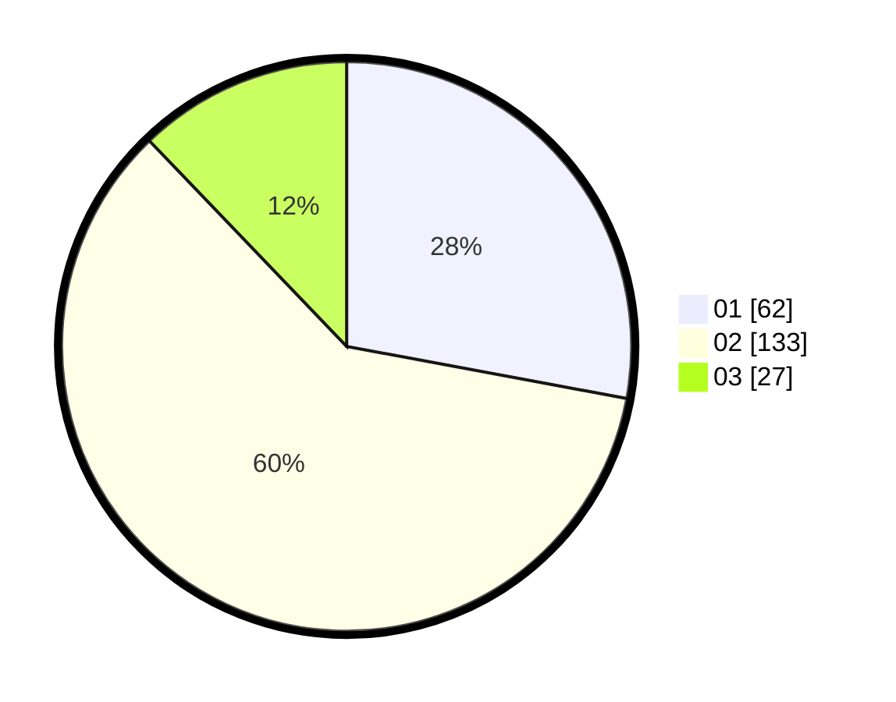

# Hasil

Hasil perolehan suara paslon dapat dilihat pada file paslon-01.txt, paslon-02.txt, dan paslon-03.txt.

Jika tidak ada, artinya data tersebut belum ada pada SIREKAP.

## Perolehan Suara

 * Paslon 01: **62**.
 * Paslon 02: **133**.
 * Paslon 03: **27**.

## Foto C Plano

https://sirekap-obj-formc.kpu.go.id/a647/pemilu/ppwp/31/72/04/10/05/3172041005109-20240214-232300--ec6e9da3-c0c5-426f-81da-9ae382678a93.jpg

https://sirekap-obj-formc.kpu.go.id/a647/pemilu/ppwp/31/72/04/10/05/3172041005109-20240214-232422--4dff4009-e3cb-43b8-8d12-8911f03c9478.jpg

https://sirekap-obj-formc.kpu.go.id/a647/pemilu/ppwp/31/72/04/10/05/3172041005109-20240215-001829--7800a1c1-cfb3-4db9-ad7c-39fbe4b7439a.jpg

## DATA PEMILIH TETAP

Jumlah pemilih dalam DPT: **287**.
 * L: **155**.
 * P: **132**.

## DATA PENGGUNA HAK PILIH

Jumlah pengguna hak pilih dalam DPT: **222**.
 * L: **113**.
 * P: **109**.

Jumlah pengguna hak pilih dalam DPTb: **1**.
 * L: **1**.
 * P: **0**.

Jumlah pengguna hak pilih dalam DPK: **2**.
 * L: **0**.
 * P: **2**.

Jumlah pengguna hak pilih: **225**.
 * L: **114**.
 * P: **111**.

## JUMLAH SUARA SAH DAN TIDAK SAH

JUMLAH SELURUH SUARA SAH: **222**.

JUMLAH SUARA TIDAK SAH: **3**.

JUMLAH SELURUH SUARA SAH DAN SUARA TIDAK SAH: **225**.
