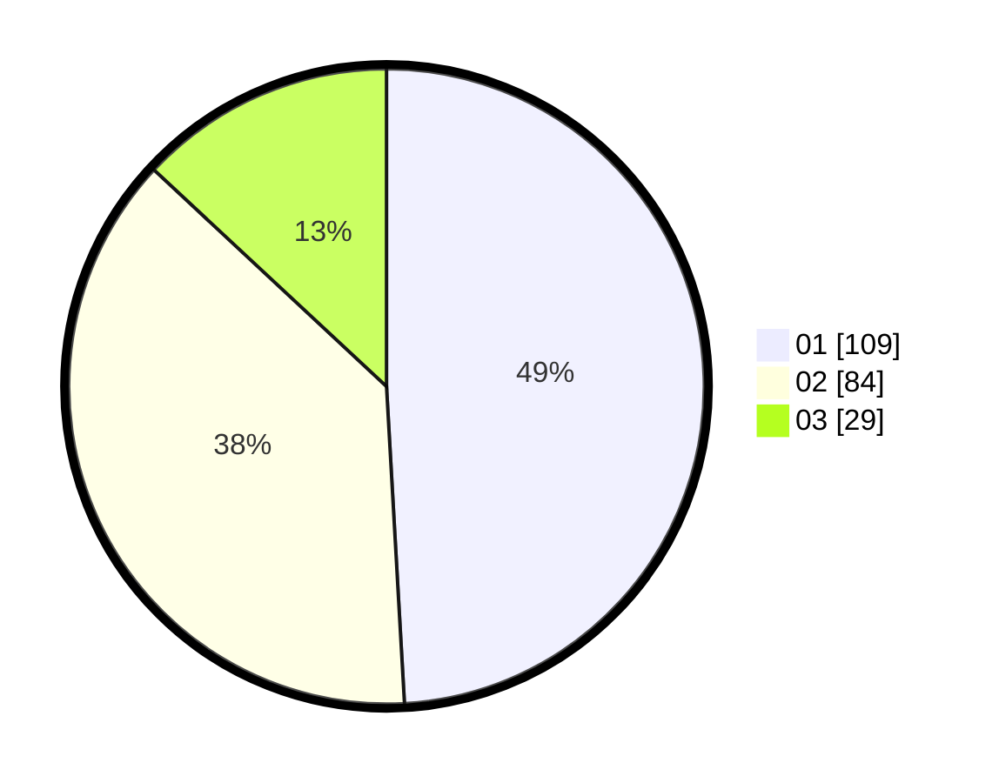

# Hasil

Hasil perolehan suara paslon dapat dilihat pada file paslon-01.txt, paslon-02.txt, dan paslon-03.txt.

Jika tidak ada, artinya data tersebut belum ada pada SIREKAP.

## Perolehan Suara

 * Paslon 01: **109**.
 * Paslon 02: **84**.
 * Paslon 03: **29**.

## Foto C Plano

https://sirekap-obj-formc.kpu.go.id/c1c3/pemilu/ppwp/31/72/04/10/06/3172041006002-20240214-201607--c2e56bcb-3c1f-4d72-ac79-c40dd9686bd5.jpg

https://sirekap-obj-formc.kpu.go.id/c1c3/pemilu/ppwp/31/72/04/10/06/3172041006002-20240214-202007--19a03ac3-d3cf-4df9-928b-fcd4a6aa5dc3.jpg

https://sirekap-obj-formc.kpu.go.id/c1c3/pemilu/ppwp/31/72/04/10/06/3172041006002-20240214-202710--a6202f54-f6b2-43e2-9cd7-dc8a82b78041.jpg

## DATA PEMILIH TETAP

Jumlah pemilih dalam DPT: **289**.
 * L: **139**.
 * P: **150**.

## DATA PENGGUNA HAK PILIH

Jumlah pengguna hak pilih dalam DPT: **216**.
 * L: **93**.
 * P: **123**.

Jumlah pengguna hak pilih dalam DPTb: **6**.
 * L: **3**.
 * P: **3**.

Jumlah pengguna hak pilih dalam DPK: **2**.
 * L: **1**.
 * P: **1**.

Jumlah pengguna hak pilih: **224**.
 * L: **97**.
 * P: **127**.

## JUMLAH SUARA SAH DAN TIDAK SAH

JUMLAH SELURUH SUARA SAH: **222**.

JUMLAH SUARA TIDAK SAH: **2**.

JUMLAH SELURUH SUARA SAH DAN SUARA TIDAK SAH: **224**.
