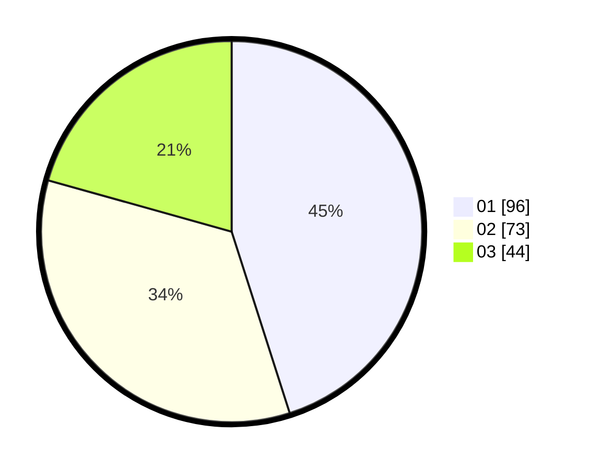

# Hasil

Hasil perolehan suara paslon dapat dilihat pada file paslon-01.txt, paslon-02.txt, dan paslon-03.txt.

Jika tidak ada, artinya data tersebut belum ada pada SIREKAP.

## Perolehan Suara

 * Paslon 01: **96**.
 * Paslon 02: **73**.
 * Paslon 03: **44**.

## Foto C Plano

https://sirekap-obj-formc.kpu.go.id/28f1/pemilu/ppwp/31/72/04/10/06/3172041006007-20240214-232010--290e87f0-0ce2-4dbf-99ec-08dd9babb871.jpg

https://sirekap-obj-formc.kpu.go.id/28f1/pemilu/ppwp/31/72/04/10/06/3172041006007-20240214-204246--afd93a10-8224-4d1a-8d3b-040b6f5047b5.jpg

https://sirekap-obj-formc.kpu.go.id/28f1/pemilu/ppwp/31/72/04/10/06/3172041006007-20240214-204603--466ad81c-8162-4c22-84c1-2bd5b9d97a3f.jpg
